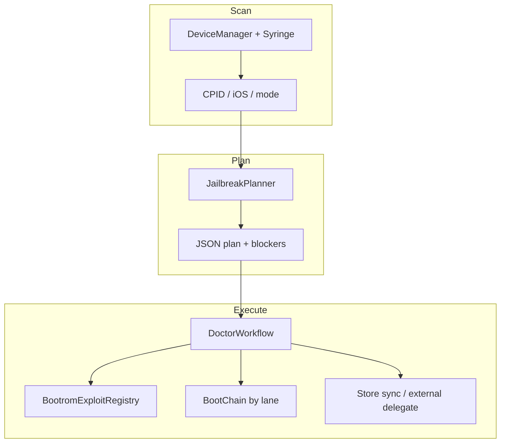

# purplepois0n MVP

**Goal:** One app that scans a connected device, picks a jailbreak strategy, and runs the matching host workflow—with optional web UI and agent API for automation (including future AI orchestration).

This document is the **single source of truth** for MVP scope, what works today, and what remains.

---

## MVP user journeys

### Journey A — Web UI (recommended)

```bash
make release plugins kpf    # once per machine
export PURPLEPOIS0N_IPSW=/path/to/firmware.ipsw   # DFU / recovery ramdisk paths
make agent                  # terminal 1 — localhost :7749
make web-dev                # terminal 2 — Vite dev server
```

1. Open the Jailbreak wizard in the browser.
2. Connect device (USB); host agent lists it via `GET /devices`.
3. Wizard step **Jailbreak** (5th dot) calls `GET /device/plan` — shows strategy, blockers, ramdisk source.
4. Consent → **Jailbreak** → `POST /jailbreak` with `auto: true`, `execute: true`.
5. Wizard step **All set** (6th dot) → sync store / install zebra package.

Probe-only (no mutation): `POST /doctor` with `"execute": false` or `jailbreak` without `--execute`.

### Journey B — CLI doctor (no UI)

```bash
# Probe: scan + plan JSON (no mutation)
./build/bin/purplepois0n device plan
# or: ./build/bin/purplepois0n --device-plan

# Full flow with JSON step stream on stdout (includes --normal-ssh for Normal-mode /var/jb probe)
./build/bin/purplepois0n jailbreak --execute
# or: export PURPLEPOIS0N_NORMAL_SSH=1 && ./build/bin/purplepois0n --doctor-run --jailbreak-execute --i-understand-jailbreak --normal-ssh
```

### Journey C — Already jailbroken (store only)

```bash
export PURPLEPOIS0N_NORMAL_SSH=1   # or use make agent (sets SSH env automatically)
./build/bin/purplepois0n device plan -d UDID          # expect normal-already-jailbroken
./build/bin/purplepois0n jailbreak --execute -d UDID  # verify /var/jb (no make plugins required)
legacy/scripts/seed-store.sh
./build/bin/purplepois0n store sync -d UDID
./build/bin/purplepois0n store install purplepois0n-zebra -d UDID
```

Web wizard: **Verify jailbreak** on the Jailbreak step; **All set** runs sync + zebra install (store runs once). See [STORE_ECOSYSTEM.md](STORE_ECOSYSTEM.md#mvp-store-journey-web-wizard).

### Journey D — Delegate-first (palera1n / Dopamine)

When in-tree Gen6 execute is incomplete, the planner selects `normal-external-delegate` or user runs palera1n/Dopamine manually, then purplepois0n handles store/bootstrap. See [STORE_ECOSYSTEM.md](STORE_ECOSYSTEM.md).

After a **fresh** delegate jailbreak, store sync is manual by default: web wizard **All set** (step 6), CLI `--post-jb-store`, agent `post_jb_store: true`, or `PURPLEPOIS0N_POST_JB_STORE=1` when planning/executing. Already-jailbroken verify does **not** sync the store.

---

## Architecture: scan → plan → execute



| Layer | Module | Role |
|-------|--------|------|
| Scan | `DeviceManager`, `Syringe` | USB mode, CPID, ECID, lockdown metadata |
| Plan | `JailbreakPlanner` | Strategy ID, `Gen0Options`, blockers, IPSW/ramdisk resolution |
| Deliver | `RamdiskDelivery`, `BootChain` | Lane-agnostic ramdisk + optional boot module |
| Execute | `DoctorWorkflow`, primitives | Bootrom → usb-loader / recovery / external / Gen6 chain |
| UI | `ui/agent`, `ui/web` | HTTP bridge + Jailbreak wizard |

**Design rule:** Ramdisk artifacts and boot modules (KPF, etc.) are **independent**. Pongo is one **usb-loader transport**, not the product model.

---

## Strategy matrix (planner)

| Strategy ID | Device state | What runs |
|-------------|--------------|-----------|
| `dfu-checkm8-usb-loader` | DFU, checkm8 CPID | Bootrom pwn → KPF + ramdisk via usb-loader |
| `dfu-usbliter8` | DFU, A12/A13/S4/S5 | Usbliter8 bootrom path |
| `dfu-unsupported` | DFU, other CPID | Blocked — no in-tree bootrom |
| `recovery-ramdisk-chain` | Recovery | iBSS → iBEC → IM4P rdsk |
| `normal-already-jailbroken` | Normal, `/var/jb` | Post-jb store / probe only |
| `normal-gen6-in-tree` | Normal, iOS 15+ | Gen6 primitive chain (partial execute) |
| `normal-external-delegate` | Normal | `external-jailbreak` script |

Planner output: `./build/bin/purplepois0n --device-plan` or `GET /device/plan?udid=…`.

---

## Environment variables (MVP)

| Variable | Purpose |
|----------|---------|
| `PURPLEPOIS0N_IPSW` | Firmware for automatic ramdisk pack (DFU/recovery) |
| `PURPLEPOIS0N_RAMDISK` | Prebuilt `.dmg` artifact (skips IPSW pack) |
| `PURPLEPOIS0N_RAMDISK_OVERLAY` | Overlay merged at pack time |
| `PURPLEPOIS0N_BOOT_MODULE` | Boot module path (aliases `PURPLEPOIS0N_KPF`) |
| `PURPLEPOIS0N_BOOT_LANE` | Force delivery lane (`usb-loader`, `recovery`, …) |
| `PURPLEPOIS0N_NORMAL_SSH` | SSH for Normal-mode store / rootless probe |
| `PURPLEPOIS0N_DEVICE_UDID` | Default UDID for agent/CLI |
| `PURPLEPOIS0N_STORE_ROOT` | Host dpkg repo root (default `store/`) |

Build-time: `make plugins` enables mutating primitives; `make kpf` builds default boot module.

---

## Agent HTTP API (localhost)

Base URL: `http://127.0.0.1:7749` (override with `PURPLEPOIS0N_AGENT_PORT`).

| Method | Path | Description |
|--------|------|-------------|
| GET | `/health` | Binary ok, plugins, capabilities |
| GET | `/devices` | Connected devices (UDID, state, CPID, firmware) |
| GET | `/device/plan?udid=` | **Device profile + jailbreak plan JSON** |
| POST | `/doctor` | NDJSON step stream; body `{ "execute": true }` |
| POST | `/jailbreak` | `{ "auto": true, "execute": true }` → doctor auto-plan |
| GET | `/store/packages` | Apt `Packages` index |
| POST | `/store/sync` | Push repo to device over SSH |
| POST | `/store/install` | `{ "package": "purplepois0n-zebra" }` on device |
| GET | `/store/installed?udid=` | Installed dpkg names for UI badges |

Full reference: [AGENT_API.md](AGENT_API.md).

---

## CLI flags (MVP subset)

| Flag / command | Purpose |
|----------------|---------|
| `device plan` / `--device-plan` | JSON scan + plan only |
| `jailbreak` / `--doctor-run` | Probe: plan JSON + steps; **no jailbreak step** unless `--execute` |
| `jailbreak --execute` | Planner merge + mutating execute (`--normal-ssh` included) |
| `--capabilities` | Host readiness JSON (plugins, kpf built, …) |
| `--ramdisk PATH` | Boot artifact (generic) |
| `--boot-lane`, `--boot-module`, `--boot-args` | Generic boot delivery |
| `--dfu-jailbreak` | DFU orchestration (bootrom + optional boot delivery) |
| `--external-jailbreak` | Delegate to palera1n/checkra1n helper |
| `--store-init`, `--store-build`, `--store-sync` | Package store |

Legacy `--pongo-*` flags remain aliases for usb-loader lane. Details: [book/deep/recovery-ramdisk.md](book/deep/recovery-ramdisk.md).

---

## MVP status (honest)

### Done ✅

- Device detection (Normal / Recovery / DFU) and enumeration
- CPID-based bootrom routing (checkm8, usbliter8)
- Generic boot delivery (ramdisk ≠ payload; lane dispatch)
- `JailbreakPlanner` + `--device-plan` + doctor plan step
- IPSW auto-resolution for ramdisk (`PURPLEPOIS0N_IPSW`)
- KPF build + offline smoke (`make kpf`, `make smoke-kpf`)
- Doctor JSON protocol + GUI launchers (`doctors/`)
- Doctor probe-only path (stops after plan; no accidental external jailbreak)
- Localhost agent + web Jailbreak wizard (plan card + auto jailbreak)
- Rootless store ecosystem (dpkg repo, SSH sync, zebra launcher) — [STORE_ECOSYSTEM.md](STORE_ECOSYSTEM.md)
- Offline smoke suite (see below)

### Partial ⚠️

- **Gen6 in-tree execute** — probe chain works; full Dopamine-parity execute not MVP-complete
- **DFU live jailbreak** — requires hardware, plugins, libusb, KPF, IPSW; offline smokes only
- **Recovery execute** — wired (`recovery.execute` on `jailbreak --execute`); still needs hardware, IPSW, plugins, TSS/apticket as applicable
- **Anthrax / Cyanide** — research stubs; not part of MVP path
- **AI orchestration** — no in-tree LLM; agent JSON is the integration surface

### Not MVP ❌

- One-click for all devices/iOS versions without external jailbreak
- Bundled IPSW download or SHSH management UI
- Production code signing / App Store distribution

---

## Smoke tests (run before demo)

Offline (no device):

```bash
make release
make smoke-mvp          # offline CI
make smoke-mvp-strict   # + capabilities, fixtures, rootless layout
```

With device (manual):

- [ ] `--device-plan` shows expected strategy for your mode (DFU vs Normal)
- [ ] `--doctor-run` (probe) completes step JSON
- [ ] DFU: `--doctor-run --jailbreak-execute --i-understand-jailbreak` with `PURPLEPOIS0N_IPSW` set
- [ ] Normal + existing jb: store sync installs a package

See [validation/mvp-smoke.md](validation/mvp-smoke.md) for the full checklist.

---

## MVP exit criteria

| Criterion | Target |
|-----------|--------|
| Web wizard shows plan before jailbreak | ✅ |
| Planner auto-fills boot module + IPSW ramdisk | ✅ |
| Doctor probe emits plan without jailbreak step | ✅ |
| Doctor execute merges planner options (consent + `--execute` / web button) | ✅ |
| Already-jailbroken execute without `make plugins` | ✅ |
| Store sync works on jailbroken Normal device | ✅ (with SSH) |
| Documented agent API for automation | ✅ |
| Offline CI smokes green | ✅ |
| Gen6 full in-tree jailbreak | ❌ post-MVP |
| All CPIDs bootrom + boot without delegate | ❌ post-MVP |

---

## Related docs

| Doc | When to read |
|-----|----------------|
| [QUICKSTART.md](../QUICKSTART.md) | First run on a dev machine |
| [STORE_ECOSYSTEM.md](STORE_ECOSYSTEM.md) | Package store staging and device sync |
| [DOCTOR.md](DOCTOR.md) | Doctor JSON steps, GUI, agent integration |
| [ARCHITECTURE.md](ARCHITECTURE.md) | Deep system layers (research scope) |
| [SUPPORT.md](SUPPORT.md) | Honest capability matrix vs historical tools |
| [book/deep/recovery-ramdisk.md](book/deep/recovery-ramdisk.md) | Ramdisk build + boot lanes |
| [IMPLEMENTATION_ROADMAP.md](IMPLEMENTATION_ROADMAP.md) | Post-MVP engineering backlog |
