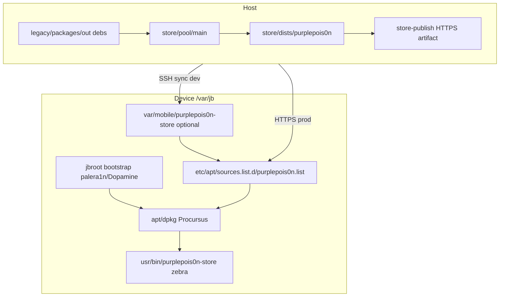
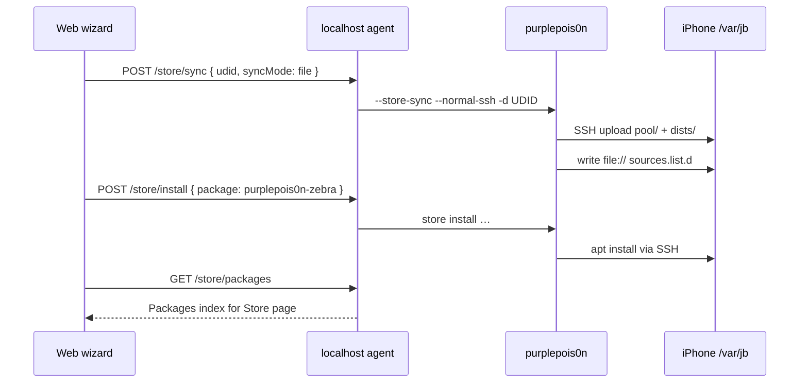

# purplepois0n package ecosystem

Host-side tooling for a rootless apt repo under `/var/jb`, integrated with Procursus bootstrap and an on-device store client (`purplepois0n-zebra` launcher or Zebra fork).

**MVP context:** After jailbreak (or when already jailbroken), the web wizard step **All set** and planner strategy `normal-already-jailbroken` use this layer. See [MVP.md](MVP.md) journey C and the [MVP store journey](#mvp-store-journey-web-wizard) below.

## Architecture

Two **delivery modes** (dev = SSH `file://`, prod = HTTPS):



### Layer definitions

| Layer | Meaning | Location |
|-------|---------|----------|
| **Package build staging** | `.deb` artifacts before entering pool | `legacy/packages/out/` |
| **Host repo** | Canonical apt repo (pool + dists) | `store/` |
| **Publish artifact** | Static HTTPS tree | `store-publish/` |
| **Device mirror** | SSH-pushed copy of repo | `/var/jb/var/mobile/purplepois0n-store` |
| **Exploit staging** | AFC/backup/ramdisk payloads | Intentionally NOT in-tree ([SUPPORT.md](SUPPORT.md)) |

**Prerequisite:** Device must already have `/var/jb` + `apt`/`dpkg` (Procursus via palera1n/Dopamine). The store does not bootstrap the OS.

## Quick start

```bash
make release
export PURPLEPOIS0N_REPO_URL=https://YOUR_HOST/purplepois0n-repo/   # prod only
legacy/scripts/seed-store.sh
legacy/scripts/deploy-https-repo.sh   # print nginx/rsync instructions
```

Subcommand CLI:

```bash
./build/bin/purplepois0n store build
./build/bin/purplepois0n store publish ./store-publish
./build/bin/purplepois0n store sync -d UDID        # file mode (default)
./build/bin/purplepois0n store install purplepois0n-smoke -d UDID
./build/bin/purplepois0n --store-sync-mode sources-only --store-sync --normal-ssh -d UDID
```

## Dev workflow (SSH file repo)

```bash
make plugins
legacy/scripts/seed-store.sh   # PURPLEPOIS0N_REPO_URL unset → zebra launcher only
# Jailbreak device (palera1n/Dopamine)
export PURPLEPOIS0N_NORMAL_SSH=1 PURPLEPOIS0N_DEVICE_UDID=…
./build/bin/purplepois0n store sync --store-sync-mode file -d "$UDID"
./build/bin/purplepois0n store install purplepois0n-zebra -d "$UDID"
```

- `store sync` (default **file** mode) uploads `pool/` + `dists/` and writes `file://` sources.
- `purplepois0n-zebra` is **launcher only** — it does not overwrite sources.list.
- Installing zebra after sync does not clobber the dev `file://` line.

## Prod workflow (HTTPS)

```bash
export PURPLEPOIS0N_REPO_URL=https://cdn.example.com/purplepois0n-repo/
legacy/scripts/seed-store.sh          # builds purplepois0n-sources with HTTPS line
legacy/scripts/deploy-https-repo.sh
# On device after jailbreak:
apt install purplepois0n-sources purplepois0n-zebra
apt update && apt install purplepois0n-smoke
```

Canonical URL rule:

```
PURPLEPOIS0N_REPO_URL=https://host/purplepois0n-repo/
→ nginx alias /var/www/purplepois0n-repo/ → store-publish contents
→ apt line: deb [trusted=yes] https://host/purplepois0n-repo/ purplepois0n main
```

`--store-sync-mode https` skips device mirror upload (device fetches from CDN).

## Store sync modes

| Mode | Upload pool+dists | Writes sources.list |
|------|-------------------|---------------------|
| `file` (default) | Yes | `file:///var/jb/var/mobile/purplepois0n-store` |
| `https` | No | No (use `purplepois0n-sources` on device) |
| `sources-only` | No | `file://` or `PURPLEPOIS0N_REPO_URL` if set |

## Seed packages

| Package | Purpose |
|---------|---------|
| `purplepois0n-smoke` | Apt repo smoke test |
| `purplepois0n-zebra` | Store launcher only (no sources.list) |
| `purplepois0n-sources` | Optional apt source (HTTPS prod or file dev) |

Build without `dpkg-deb` (macOS-friendly):

```bash
# Dev (launcher only)
python3 legacy/packages/build_debs.py --zebra-sources none

# Prod (HTTPS sources deb)
PURPLEPOIS0N_REPO_URL=https://cdn.example.com/purplepois0n-repo/ \
  python3 legacy/packages/build_debs.py --zebra-sources https
```

## Post-jailbreak store (no IPA required)

```bash
./build/bin/purplepois0n external-jailbreak --already-jailbroken \
  --post-jb-store --post-jb-store-install purplepois0n-zebra \
  --normal-ssh -d UDID
```

Or store-only post-jb pipeline:

```bash
./build/bin/purplepois0n post-jb --store --store-install purplepois0n-zebra \
  --normal-ssh -d UDID
```

## MVP store journey (web wizard)

End-to-end path after the Jailbreak wizard completes (step 5 **All set**):



### Prerequisites

1. Device jailbroken with `/var/jb` + Procursus `apt` (palera1n, Dopamine, or in-tree path).
2. SSH reachable from host (`PURPLEPOIS0N_NORMAL_SSH=1`; wizard uses agent env).
3. Host repo seeded: `legacy/scripts/seed-store.sh` or `make seed-store`.

### One-time host setup

```bash
make release plugins
legacy/scripts/seed-store.sh
make agent    # terminal 1
make web-dev  # terminal 2
```

### Wizard step 5 actions

| UI button | Agent call | CLI equivalent |
|-----------|------------|----------------|
| Sync & install store | `POST /store/sync` then `POST /store/install` | `store sync` + `store install purplepois0n-zebra` |
| Load packages (no device) | `GET /store/packages` | `store build` on host |

Installed packages on a selected device show an **Installed** badge via `GET /store/installed?udid=`.

### CLI-only equivalent (no web UI)

```bash
export PURPLEPOIS0N_NORMAL_SSH=1 PURPLEPOIS0N_DEVICE_UDID=YOUR_UDID
legacy/scripts/seed-store.sh
./build/bin/purplepois0n --device-plan -d "$UDID"   # expect normal-already-jailbroken
./build/bin/purplepois0n store sync -d "$UDID"
./build/bin/purplepois0n store install purplepois0n-zebra -d "$UDID"
```

Hardware validation: `make smoke-e2e-delegate` with `PURPLEPOIS0N_DEVICE_UDID` set ([validation/mvp-smoke.md](validation/mvp-smoke.md)).

## Web UI

- **Host catalog:** agent `GET /store/packages` (default Store page view).
- **Device installed state:** agent `GET /store/installed?udid=` → `dpkg -l` over SSH; **Installed** badge on packages when a device UDID is selected.
- Wizard step 5: `store sync` (file mode) + install zebra — see [MVP store journey](#mvp-store-journey-web-wizard).

Host UIs: `make agent` + `make web-dev` or `make tui`

## Components

| Layer | Tool | Location |
|-------|------|----------|
| Host repo builder | `DpkgStore` | `src/store/` |
| Device sync | `DpkgStoreSync` | `src/store/DpkgStoreSync.cpp` |
| CLI | subcommands + flags | `src/cli/CliParser.cpp`, `src/purplepois0n.cpp` |
| Seed packages | `build_debs.py` | `legacy/packages/` |
| Agent API | Python HTTP bridge | `ui/agent/purple_agent.py` |
| Web UI | React store + jailbreak wizard | `ui/web/` |
| Bootstrap probe | `RootlessBootstrapPrimitive` | `src/primitives/` |
| On-device store | `purplepois0n-zebra` or Zebra fork | `legacy/zebra-purple/` |

## Environment variables

| Variable | Purpose |
|----------|---------|
| `PURPLEPOIS0N_STORE_ROOT` | Host repo path (default `./store`) |
| `PURPLEPOIS0N_REPO_URL` | HTTPS repo URL for `purplepois0n-sources` + publish docs |
| `PURPLEPOIS0N_ZEBRA_SOURCES` | Override `none\|https\|file` for seed deb build |
| `PURPLEPOIS0N_PUBLISH_ROOT` | Output for `seed-store.sh` (default `./store-publish`) |
| `PURPLEPOIS0N_JBROOT` | Device jbroot prefix (default `/var/jb`) |
| `PURPLEPOIS0N_NORMAL_SSH` | Enable SSH sync path (`1`) |
| `PURPLEPOIS0N_DEVICE_UDID` | Default UDID for device smoke tests |

## Related docs

- [validation/store-repo-smoke.md](validation/store-repo-smoke.md)
- [GENERATIONS.md](GENERATIONS.md)
- [book/07-dopamine-rootless.md](book/07-dopamine-rootless.md)
