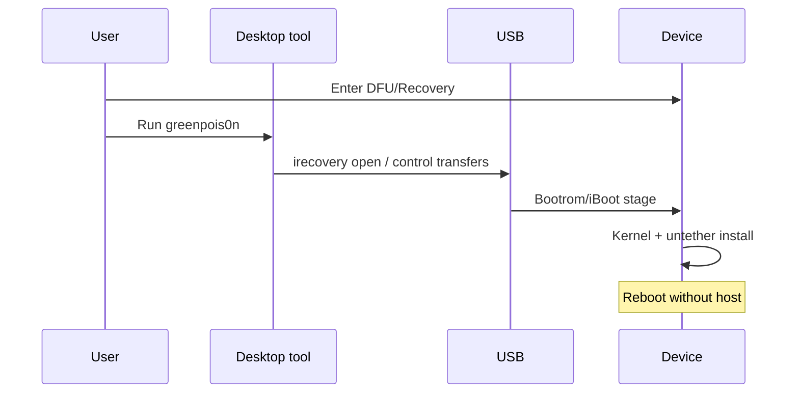

# Chapter 0: Chronic Dev Team — greenpois0n era

**Depth TOC:** [L0](#l0--summary) · [L1](#l1--history) · [L2](#l2--ecosystem) · [L3](#l3--security-engineering) · [L4](#l4--host-tooling-architecture) · [L5](#l5--purplepois0n-this-era) · [L6](#l6--sources--further-reading)

See [DEPTH.md](DEPTH.md) for how to read levels.

## L0 — Summary

greenpois0n (~2010–2011) was a desktop host utility that drove A4-era devices through **Recovery/DFU USB** to deliver an **untethered** jailbreak on iOS 4.2.1-class firmware, combining bootrom-class entry (limera1n/SHAtter lineage) with kernel and userland persistence—establishing the detect-mode → stage-over-USB template purplepois0n still follows.

## L1 — History

| Field | Detail |
|-------|--------|
| **Years** | ~2010–2011 (primary); branding later reused for Absinthe |
| **iOS versions** | 4.1, 4.2.1, 4.2.6 (CDMA); iPad 3.2.2 |
| **Teams** | Chronic Dev Team; overlap with iPhone Dev Team, geohot (limera1n), Comex (untether components) |
| **Platforms** | Desktop tools for macOS, Windows; Linux support varied by release |
| **Jailbreak type** | **Untethered** on 4.2.1-class releases; earlier RC paths more tethered/semi depending on device |

Notable timeline (public sources):

- **October 2010:** Initial release targeting iOS 4.1; planned 10/10/10 launch slipped after geohot’s limera1n (9 Oct 2010).
- **February 2011:** RC5/RC6.x — untethered **4.2.1** (and 4.2.6 on Verizon iPhone 4); credited to posixninja and Chronic Dev on community wikis.

Earlier RC builds mixed **SHAtter** (bootrom, A4-only) with Comex-supplied userland pieces; release shifted to **limera1n’s** bootrom path after the October 2010 race. RC5 moved to a different kernel primitive (HFS-related) that Apple closed before 4.3 shipped.

| Problem | How greenpois0n addressed it (conceptually) |
|---------|---------------------------------------------|
| Apple signing / code execution restrictions | Bootrom or closely coupled low-level entry, then kernel patches |
| Re-jailbreak after every reboot | **Untethered** persistence on supported firmware |
| Host-driven restore/DFU workflows | Single GUI/CLI tool for multiple device modes |

## L2 — Ecosystem

| Aspect | This era | vs prior |
|--------|----------|----------|
| **Package manager** | **Cydia** (saurik) dominant; MobileSubstrate for tweaks |
| **Bootstrap** | Install Cydia + essential packages after kernel patch; `amfid`/mount patches common |
| **Host tools** | greenpois0n, **redsn0w**, **limera1n** (geohot), TinyUmbrella/SHSH culture |
| **Community** | Chronic Dev vs iPhone Dev Team coordination; race with limera1n defined October 2010 narrative |
| **Persistence model** | True **untether**—no re-run host tool after reboot on supported builds |

Users expected a Windows/macOS download, DFU button combo, and one successful run. Semi-untether and backup-mediated flows were not the norm yet (see Chapter 1).

## L3 — Security engineering

**Mitigations of the era**

- Early **ASLR** in userspace; kernel slide weaker than modern KASLR.
- **DFU bootrom** issues on A4 (and limera1n) enabled repeatable low-level entry.
- No PAC, KTRR, sealed system volume, or rootless layout.

**Threat model (host-centric)**

- Attacker with **USB physical access** and a trusted/vulnerable bootrom path could alter early boot.
- No expectation of remote DFU exploitation in public narratives.

**Chain shape (conceptual stages only)**

1. User places device in **DFU** (or Recovery for some paths); host tool runs low-level USB work.
2. Bootrom or early boot stage compromised → loader chains toward iBoot/kernel.
3. **Kernel** patch grants privileged execution.
4. Install bootstrap (Cydia era), patch signing/mount policy as needed.
5. **Untether** stores persistence so reboot does not require the host PC.

## L4 — Host tooling architecture

Historical greenpois0n-class tools sat on the same USB stack purplepois0n uses conceptually:

| Layer | Public stack | Role in era |
|-------|--------------|-------------|
| USB | OS driver + libusb/irecovery | DFU and Recovery bulk/control transfers |
| **DFU / Recovery** | libirecovery lineage, `irecv` tools | Exploit delivery, IMG/iboot staging |
| **Normal** | usbmuxd + lockdown (predecessor to libimobiledevice) | Post-boot status, sometimes AFC |
| Desktop UI | greenpois0n, redsn0n | Mode detection, one-click jailbreak |

**Typical user flow (architecture, not steps):**

**Sources:** libirecovery project (https://github.com/libimobiledevice/libirecovery); Wikipedia/Greenpois0n wiki for tool behavior summaries.

## L5 — purplepois0n (this era)

**Honest status:** Generation 0 is **not** a shipping greenpois0n replacement. See **[SUPPORT.md](../../SUPPORT.md)** for the full capability matrix and CLI flags (`--gen0`, `--analyze-backup`).

**Applicable workflow:** [`Gen0Workflow::runGen0Jailbreak`](../../src/Gen0Workflow.cpp) — `DeviceState::DFU` (primary), `DeviceState::Recovery` (secondary). Normal mode was not the main greenpois0n entry.

| Component | Status | Era fit |
|-----------|--------|---------|
| [`DeviceManager`](../../src/DeviceManager.cpp) | **Implemented** — DFU-first detect; ECID/CPID in `-l` |
| [`IRecvUtil`](../../src/IRecvUtil.h) | **Implemented** — irecv retry, USB memory encoding |
| [`DFUDevice`](../../src/DFUDevice.h) | **Implemented** — libirecovery 1.x client, R/W, commands |
| [`RecoveryDevice`](../../src/RecoveryDevice.h) | **Implemented** — ECID-scoped irecv; `sendFile`, `reset`, `reboot` |
| [`Gen0Workflow`](../../src/Gen0Workflow.cpp) + [`ChainRunner`](../../include/primitives/ChainRunner.h) | **Scaffold** — Detect→Connect→Probe→Report; Recovery TSS/upload probes |
| [`TssClient`](../../src/TssClient.cpp) / [`RecoveryUploadPrimitive`](../../src/primitives/RecoveryUploadPrimitive.cpp) | **Partial** — live SHSH, personalize, upload (probe/execute gated) |
| [`CrashSlideHelper`](../../src/CrashSlideHelper.cpp) | **Implemented** — offline `--analyze-crash` (absinthe-era research) |
| [`Checkm8`](../../src/Checkm8.cpp) | **Ext** — `-m` delegates to gaster/ipwndfu |
| [`gen0-24kpwn`](../../include/primitives/HistoricalExploitModules.h) | **Stub** — old-BR 3GS / iPod 2G untether delegate (`PURPLEPOIS0N_24KPWN`) |
| limera1n / SHAtter / untether bytes | **NOT** | External or contributor modules |

DFU `-j` runs probe chain only; `-m` runs checkm8 via external tools after probe. Recovery uses `getRecoveryEcid()` from enumeration — see [deep/dfu-recovery.md](deep/dfu-recovery.md), [deep/primitives-gen0.md](deep/primitives-gen0.md).

**Deep dives:** [device-manager.md](deep/device-manager.md), [dfu-recovery.md](deep/dfu-recovery.md), [24kpwn.md](deep/24kpwn.md), [primitives-gen0.md](deep/primitives-gen0.md), [tss-futurerestore.md](deep/tss-futurerestore.md)

**Legacy source study:** Local Chronic-Dev mirrors (`legacy/Chronic-Dev/syringe`, `gp2`, `gprc5`, `libirecovery`) are indexed in [legacy/LEARNINGS.md](../legacy/LEARNINGS.md). Host I/O and backup parsers are complete per [legacy/PHASE_STATUS.md](../legacy/PHASE_STATUS.md) and [legacy/INTEGRATION_PLAN.md](../legacy/INTEGRATION_PLAN.md).

See also [GENERATIONS.md — Generation 0](../GENERATIONS.md#generation-0-chronic-dev-era-predecessors).

## L6 — Sources & further reading

| Type | URL | Notes |
|------|-----|-------|
| Encyclopedia overview | https://en.wikipedia.org/wiki/Greenpois0n | Dates, limera1n/SHAtter context |
| Community wiki | https://www.theiphonewiki.com/wiki/Greenpois0n_(jailbreak) | RC history, exploit names (high level) |
| Mirror wiki | https://theapplewiki.com/wiki/Greenpois0n_(jailbreak) | Same lineage |
| Contemporary press | https://www.techhive.com/article/218703/greenp0ison_update_lets_you_jailbreak_ios_4_2_1.html | Feb 2011 4.2.1 |
| Related bootrom tool | https://en.wikipedia.org/wiki/Limera1n | geohot, Oct 2010 |

**Not found:** Official Chronic Dev blog still online; DEF CON/Black Hat talks titled “greenpois0n”; canonical first-party source tarball on a major Git host.

**Archive suggestions:** Search archive.org for `greenpois0n.com`, Chronic Dev announcements (2010–2011), and early `irecv` bundles shipped with tools.

- [LINEAGE.md — Predecessors](../LINEAGE.md#predecessors)
- [DEPTH.md](DEPTH.md)
- [legacy/LEARNINGS.md](../legacy/LEARNINGS.md) · [legacy/REPO_INDEX.md](../legacy/REPO_INDEX.md) · [legacy/PHASE_STATUS.md](../legacy/PHASE_STATUS.md)
