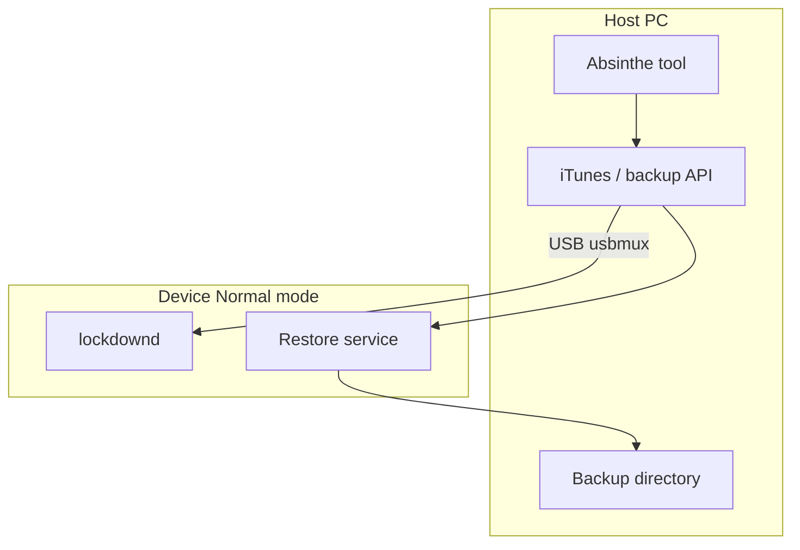

# Chapter 1: Chronic Dev Team — Absinthe era

**Depth TOC:** [L0](#l0--summary) · [L1](#l1--history) · [L2](#l2--ecosystem) · [L3](#l3--security-engineering) · [L4](#l4--host-tooling-architecture) · [L5](#l5--purplepois0n-this-era) · [L6](#l6--sources--further-reading)

## L0 — Summary

Absinthe (2012) delivered the first **untethered** jailbreak for **iPhone 4S / iPad 2** on iOS 5.x by shifting to **normal-mode, backup-mediated** host staging plus on-device activation triggers—defining the workflow purplepois0n’s `MobileBackup` and `MobileDevice` layers support for research, not weaponized restore.

## L1 — History

| Field | Detail |
|-------|--------|
| **Years** | January–May 2012 |
| **iOS versions** | 5.0 / 5.0.1 (A5 focus); **Absinthe 2.0** → 5.1.1 broad device support |
| **Teams** | Chronic Dev Team, **pod2g**; “Dream Team” for A5 |
| **Jailbreak type** | **Untethered** on supported builds |

Absinthe extended the greenpois0n brand as a **normal-mode, backup-mediated** tool: the host constructs or restores an iTunes backup that stages files, then the user completes activation via a home-screen web clip or VPN-on-demand trigger (documented on wikis only).

| Problem | Approach (high level) |
|---------|------------------------|
| A5 sandbox / bootstrapping | Dream Team collaboration (wikis) |
| No public bootrom path on 4S/iPad 2 | **Userland** chain + **backup/restore** delivery |
| Untether for 5.0.1 | **Corona** + Absinthe; 5.1.1 via **Rocky Racoon** / Absinthe 2.0 |

## L2 — Ecosystem

| Aspect | Absinthe era | vs greenpois0n (Ch. 0) |
|--------|--------------|-------------------------|
| **Delivery** | iTunes backup/restore + on-device trigger | DFU-first USB exploit tool |
| **Packages** | Cydia; **Corona** / **Rocky Racoon** untether packages | RC untethers bundled in tool flow |
| **Alternate path** | redsn0w 0.9.10 for Corona on some setups | redsn0w parallel, not Absinthe-only |
| **Trust** | Host must pair with device; backup encryption matters | Less emphasis on Finder backup domains |

Users with an existing **tethered** jailbreak could sometimes upgrade via Cydia packages instead of full restore.

## L3 — Security engineering

**Mitigations**

- Stronger **sandbox** on A5; ASLR in userspace.
- Apple closed naive Mach-O loader tricks—Corona’s racoon/IPsec path is a public response (conceptual).
- No PAC/KTRR; system partition still writable in classic rootful installs.

**Chain shape (conceptual stages)**

1. Userland foothold or configuration flaw in a privileged daemon (wikis: racoon/IPsec, HFS family for Corona).
2. **Kernel** exploit or patch.
3. **Staging:** files in signed backup domain → restore via iTunes protocol.
4. **User completion:** web clip or VPN trigger (Absinthe A5).
5. **Persistence:** Rocky Racoon / Corona via Cydia.

## L4 — Host tooling architecture

| Channel | Technology | Absinthe-era use |
|---------|------------|------------------|
| USB mux | usbmuxd | Single cable to trusted device |
| Backup | Apple mobile backup protocol | Stage plist/assets in domains |
| Lockdown | Pairing records | Trust gate |
| Post-jailbreak | AFC (if available) | File access—not Absinthe’s primary entry |

Public references: iPhone Wiki “Absinthe”; pod2g WWJC 2012 PDF (jailbreak techniques, high level); libimobiledevice backup/mobilebackup2 lineage for open-stack equivalents.

purplepois0n implements **offline** backup parsing only—see L5.

## L5 — purplepois0n (this era)

**Honest status:** Absinthe-style **backup restore and untether** are **not** implemented. See **[SUPPORT.md](../../SUPPORT.md)**. Offline analysis: `purplepois0n --analyze-backup PATH`. Live normal-mode scaffold: `--gen0` / default jailbreak via [`Gen0Workflow`](../../src/Gen0Workflow.cpp).

**Primary branch:** `DeviceState::Normal` in `runGen0Jailbreak()`.

| Component | Status | Absinthe parallel |
|-----------|--------|-------------------|
| [`MobileDevice`](../../src/MobileDevice.h) | **Implemented** | Lockdown, app list, `ProductVersion` |
| [`MobileBackup`](../../src/MobileBackup.cpp) | **Implemented** (plist + mbdb + Manifest.db) | Parse manifests, domains, `extractFile` |
| [`AFCService`](../../src/AFCService.h) | **Implemented** | `uploadFile` / `downloadFile` (API; trusted device) |
| [`NormalModeProbePrimitive`](../../src/primitives/NormalModeProbePrimitive.cpp) | **Implemented** | App count in `--gen0` probe chain |
| `--report FILE` / `ChainRunner` | **Implemented** | JSON probe report |
| Backup **restore** / malicious staging | **NOT** | Intentional educational boundary |
| Manifest.mbdb / Manifest.db | **Implemented** (`MbdbParser`, `ManifestDbParser`) | Offline `--analyze-backup`; no restore |
| Userland exploit / untether | **NOT** | Contributor hook via primitive registry |

`MobileBackup` constructor flow (`MobileBackup.cpp`): locate manifest → `parseInfoPlist()` → `parseManifest()` → indexed `BackupFileInfo` by domain/path.

**Deep dives:** [normal-mode-afc-backup.md](deep/normal-mode-afc-backup.md), [primitives-gen0.md](deep/primitives-gen0.md)

**Legacy source study:** Absinthe-era host code (`legacy/Chronic-Dev/absinthe-2.0`, `apparition`, `OpenJailbreak/libmbdb`) informed clean-room **Manifest.mbdb** and **Manifest.db** parsers in `src/`. Status rollup: [legacy/PHASE_STATUS.md](../legacy/PHASE_STATUS.md). Restore and weaponized staging remain out of scope per [SUPPORT.md](../SUPPORT.md).

[LINEAGE.md](../LINEAGE.md) · [GENERATIONS.md — Generation 0](../GENERATIONS.md#generation-0-chronic-dev-era-predecessors)

## L6 — Sources & further reading

| Type | URL | Notes |
|------|-----|-------|
| Press (4S / iPad 2) | https://www.macrumors.com/2012/01/20/absinthe-a5-brings-first-untethered-jailbreak-for-iphone-4s-and-ipad-2/ | Jan 2012 |
| Wikipedia | https://en.wikipedia.org/wiki/Absinthe_(software) | Absinthe 2.0 |
| iPhone Wiki | https://www.theiphonewiki.com/wiki/Absinthe | Backup restore narrative |
| Corona | https://www.theiphonewiki.com/wiki/Corona | pod2g / HFS themes |
| WWJC 2012 PDF | https://papers.put.as/papers/ios/2012/pod2g-jailbreak-techniques-wwjc-2012.pdf | Techniques talk |
| Rocky Racoon | https://theapplewiki.com/wiki/Rocky_Racoon | 5.1.1 untether |

**Not found:** Live `cache.greenpois0n.com` triggers; first-party Chronic Dev source repo; Black Hat talk listing for Absinthe.

**Archive.org:** `greenpois0n.com` cache pages, 2012 MacRumors mirrors, pod2g blog posts referenced by iClarified summaries.

**Legacy integration docs (purplepois0n):** [LEARNINGS.md](../legacy/LEARNINGS.md) · [REPO_INDEX.md](../legacy/REPO_INDEX.md) · [INTEGRATION_PLAN.md](../legacy/INTEGRATION_PLAN.md) · [COMPARISON_MATRIX.md](../legacy/COMPARISON_MATRIX.md) · [PHASE_STATUS.md](../legacy/PHASE_STATUS.md)
