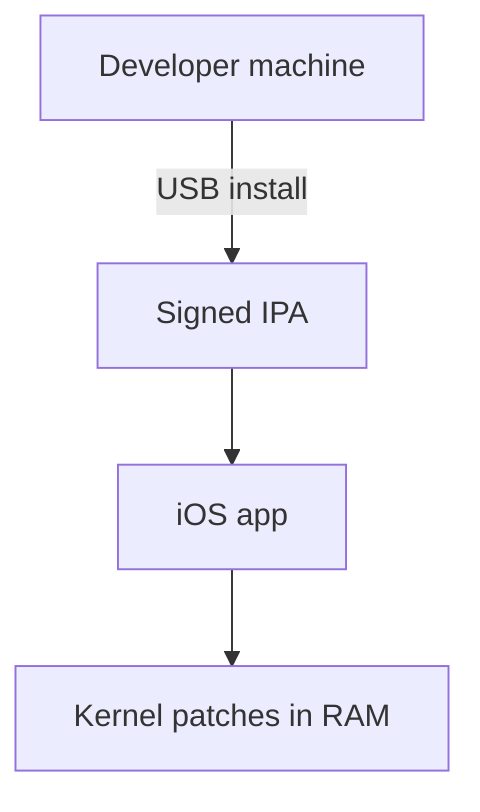

# Chapter 4: iOS 10 — yalu & semi-untether era

**Depth TOC:** [L0](#l0--summary) · [L1](#l1--history) · [L2](#l2--ecosystem) · [L3](#l3--security-engineering) · [L4](#l4--host-tooling-architecture) · [L5](#l5--purplepois0n-this-era) · [L6](#l6--sources--further-reading)

## L0 — Summary

iOS 10 (~2016–2018) normalized **semi-untethered** jailbreaks (yalu, mach_portal, Meridian) as **KTRR** reduced persistent kernel patching—users re-ran sideloaded apps after reboot while host USB tooling focused on IPA delivery, logs, and binary research.

## L1 — History

| Field | Detail |
|-------|--------|
| **Years** | ~2016–2018 |
| **iOS** | 10.0–10.2 (yalu102); 10.1–10.1.1 (mach_portal); 10.3.3 (Meridian); 10.2.1 (Saïgon subset) |
| **Researchers** | Luca Todesco, Marco Grassi; Xerub, Ian Beer, Siguza (adjacent) |

| Tool | Type | Scope (public) |
|------|------|----------------|
| yalu + mach_portal | Semi-untethered | 10.0–10.1.1; iPhone 7 |
| yalu102 | Semi-untethered | 10.0–10.2; most 64-bit except 7 on 10.2 (KPP) |
| extra_recipe | Semi-untethered | 10.0–10.1.1; iPhone 7 family |
| Meridian | Semi-untethered | 10.3.3 64-bit |

## L2 — Ecosystem

| Aspect | iOS 10 shift |
|--------|----------------|
| **Persistence** | Re-tap jailbreak app; true untether rare |
| **Distribution** | Cydia Impactor / enterprise IPA era |
| **Substrate** | Still dominant; stability varies by build |
| **32-bit** | h3lix/doubleH3lix parallel track (see appendix) |
| **Research exit** | Luca “done” tweet Mar 2017 (wiki) |

vs Pangu 9.x: same semi pattern, stronger KTRR narrative on 10.x.

## L3 — Security engineering

**Mitigations**

- **KTRR** — kernel text not trivially patched in RAM.
- Stricter **AMFI**; build-locked public exploits.
- **A10** separate KPP path; yalu102 README excludes 10.2 on A10.

**Chain shape (conceptual)**

1. Sideloaded **IPA** on device.
2. App triggers userland → kernel (+ KPP bypass where needed).
3. In-memory patches; Substrate/Cydia when stable.
4. Reboot → user runs app again.

## L4 — Host tooling architecture

| Path | Technology | Role |
|------|------------|------|
| IPA install | installation_proxy / Xcode / Impactor | Get jailbreak app on device |
| Normal USB | usbmux + lockdown | Trust, version check, AFC logs |
| On-device | No DFU for mainstream yalu | Exploit runs on phone |
| Host analysis | GitHub READMEs, IPSW binaries | Offset research |

Public: https://github.com/kpwn/yalu102 (device table, hashes—not exploit bytes).

## L5 — purplepois0n (this era)

**Branch:** `DeviceState::Normal` — models “connect trusted device, prepare host-side support”; actual semi-untether trigger stays on-device.

| Component | Status |
|-----------|--------|
| `performJailbreak()` Normal | **TODO** — placeholder for re-run coordination |
| [`MobileDevice::getInstalledApplications`](../../src/MobileDevice.h) | **Implemented** — detect jailbreak app bundle IDs (caller-defined) |
| [`AFCService`](../../src/AFCService.h) | **Implemented** — logs/artifacts |
| [`DyldCacheParser`](../../src/DyldCacheParser.h) / [`MachOParser`](../../src/MachOParser.h) | **Implemented** — patchfinding support |
| DFU/Recovery | Not primary for yalu mainstream |

**Deep dives:** [normal-mode-afc-backup.md](deep/normal-mode-afc-backup.md), [binary-parsers.md](deep/binary-parsers.md)

[GENERATIONS.md — Generation 3](../GENERATIONS.md#generation-3-ios-10-semi-untether-era)

## L6 — Sources & further reading

| Type | URL |
|------|-----|
| yalu102 GitHub | https://github.com/kpwn/yalu102 |
| Apple Wiki — yalu | https://theapplewiki.com/wiki/Yalu |
| Luca tweet | https://twitter.com/qwertyoruiopz/status/846410691368157185 |

**Not found:** Luca peer-reviewed paper; DEF CON yalu102 talk; docs beyond GitHub README.

**Archive:** Redmond Pie mach_portal articles; old Impactor documentation.

- [appendix-32bit-legacy.md](appendix-32bit-legacy.md)

**Legacy integration docs (purplepois0n):** [LEARNINGS.md](../legacy/LEARNINGS.md) · [REPO_INDEX.md](../legacy/REPO_INDEX.md) · [INTEGRATION_PLAN.md](../legacy/INTEGRATION_PLAN.md) · [COMPARISON_MATRIX.md](../legacy/COMPARISON_MATRIX.md) · [PHASE_STATUS.md](../legacy/PHASE_STATUS.md)
