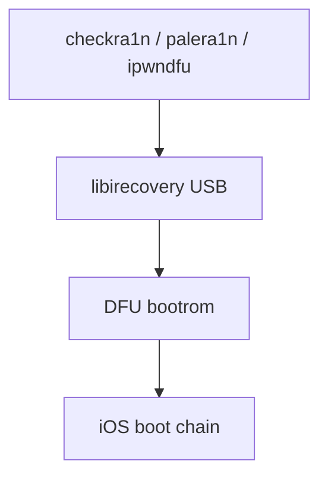

# Chapter 6: checkm8, checkra1n & palera1n

**Depth TOC:** [L0](#l0--summary) · [L1](#l1--history) · [L2](#l2--ecosystem) · [L3](#l3--security-engineering) · [L4](#l4--host-tooling-architecture) · [L5](#l5--purplepois0n-this-era) · [L6](#l6--sources--further-reading)

## L0 — Summary

**checkm8** (2019) is a **bootROM-class USB flaw** on A5–A11 silicon; **checkra1n** and **palera1n** chain it into **semi-tethered** jailbreaks on modern iOS—host-heavy DFU workflows that align directly with purplepois0n’s `DFUDevice` and `RecoveryDevice` layers (exploits still external).

## L1 — History

| Field | Detail |
|-------|--------|
| **Years** | 2019–present |
| **Hardware** | checkm8: A5–A11; not A12+ phones |
| **Tools** | axi0mX ipwndfu; checkra1n; palera1n (iOS 15+) |
| **Type** | Hardware-assisted **semi-tethered** |

Sep 2019: axi0mX published checkm8. Nov 2019: checkra1n beta. 2022+: palera1n for iOS 15–18+ on same silicon (rootful fakefs / rootless).

**Not solved:** Untether on current iOS without re-host; A12+ consumer phones use other toolchains (Ch. 7).

## L2 — Ecosystem

| Aspect | checkm8 era |
|--------|-------------|
| **Bootstrap** | Procursus influence grows (especially palera1n) |
| **Re-jailbreak** | Re-run **host** tool after power cycle |
| **Linux/macOS** | checkra1n host-first; palera1n CLI documented |
| **A11 caveat** | Passcode/SEP warnings in palera1n README |
| **vs software JB** | Permanent bootrom stage, impermanent iOS patches |

Community treats checkm8 devices as a separate “lane” from Dopamine A12+ lane.

## L3 — Security engineering

**After bootrom**

- **SEP**, **APFS**, passcode/kbag still matter.
- **PAC / PPL / SPTM** on newer iOS—complexity moves post-bootrom.
- checkm8 is **local USB only** (press/axi0mX).

**Chain shape (conceptual)**

1. **DFU** + host checkm8 (timing-sensitive per ipwndfu README).
2. Pwned DFU → patched iBoot / Pongo / ramdisk / KPF (tool-specific).
3. Boot iOS with bootstrap.
4. Re-run host jailbreak after power cycle.

palera1n: **fakefs-rootful** vs **rootless** under SSV constraints.

## L4 — Host tooling architecture



| Component | Public reference |
|-----------|------------------|
| DFU USB | ipwndfu, libirecovery |
| KPF / Pongo | checkra1n project |
| Ramdisk | Bundled IPSW components (tool-specific) |
| Normal mode | AFC/SSH after jailbreak—not boot entry |

Ars Technica 2019 interview explains bootROM properties at journalism depth.

## L5 — purplepois0n (this era)

**Branches:** `DeviceState::DFU` (primary), `DeviceState::Recovery` (secondary).

| Component | Status |
|-----------|--------|
| [`DFUDevice`](../../src/DFUDevice.h) | **Implemented** — USB memory R/W, commands |
| [`RecoveryDevice`](../../src/RecoveryDevice.h) | **Implemented** — needs ECID wiring in CLI |
| [`DeviceManager`](../../src/DeviceManager.cpp) | **Implemented** — DFU-first detect |
| checkm8, Pongo, KPF, ramdisks | **Not in-tree** — use external projects |
| `performJailbreak()` DFU | **TODO** — logs device type only |
| `performJailbreak()` Recovery | **TODO** — no `getRecoveryDevice` yet |

DFU path matches checkra1n **transport** only:

```127:139:src/purplepois0n.cpp
            case DeviceState::DFU: {
                auto device = manager.getDFUDevice();
                ...
                Logger::warn("DFU mode exploit not yet implemented");
```

Integrators would call external checkm8 module from this branch, then optionally `RecoveryDevice` for iBoot steps.

**Deep dives:** [dfu-recovery.md](deep/dfu-recovery.md), [device-manager.md](deep/device-manager.md)

[GENERATIONS.md — Generation 5](../GENERATIONS.md#generation-5-checkm8-hardware-era)

## L6 — Sources & further reading

| Type | URL |
|------|-----|
| ipwndfu | https://github.com/axi0mX/ipwndfu |
| Ars interview | https://arstechnica.com/information-technology/2019/09/developer-of-checkm8-explains-why-idevice-jailbreak-exploit-is-a-game-changer/ |
| checkra1n wiki | https://theapplewiki.com/wiki/Checkra1n |
| palera1n | https://github.com/palera1n/palera1n |
| palera1n man | https://github.com/palera1n/palera1n/blob/main/docs/palera1n.1 |
| alloc8 | https://github.com/axi0mX/alloc8 |

**Not found:** Apple acknowledgment doc; verified 2019 POC video archive (press mentions only).

**Archive:** checkra.in historical releases; early ipwndfu README snapshots.

**Legacy integration docs (purplepois0n):** [LEARNINGS.md](../legacy/LEARNINGS.md) · [REPO_INDEX.md](../legacy/REPO_INDEX.md) · [INTEGRATION_PLAN.md](../legacy/INTEGRATION_PLAN.md) · [COMPARISON_MATRIX.md](../legacy/COMPARISON_MATRIX.md) · [PHASE_STATUS.md](../legacy/PHASE_STATUS.md) — local ipwndfu mirror under `legacy/OpenJailbreak/ipwndfu`.
