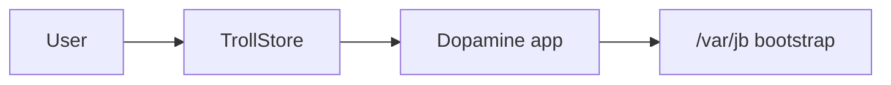

# Chapter 7: Dopamine & rootless modern era

**Depth TOC:** [L0](#l0--summary) · [L1](#l1--history) · [L2](#l2--ecosystem) · [L3](#l3--security-engineering) · [L4](#l4--host-tooling-architecture) · [L5](#l5--purplepois0n-this-era) · [L6](#l6--sources--further-reading)

## L0 — Summary

Dopamine (2023+) typifies **rootless semi-untethered** jailbreaks on iOS 15–18+ for arm64/arm64e: state under `/var/jb`, **TrollStore** install paths, Procursus/ElleKit/Sileo. **Dopamine 2.x** (2024+) centers on composable kernel primitives—especially **PUAF** (physical use-after-free) via **kfd/libkfd**, plus later picker options (weightBufs, multicast_bytecopy, DarkSword). purplepois0n offers Normal-mode USB and offline IPSW analysis, not in-tree exploits or bootstrap packages.

**Deep dive (PUAF / kfd):** [deep/puaf-kfd-era.md](deep/puaf-kfd-era.md)

## L1 — History

| Field | Detail |
|-------|--------|
| **Years** | 2023–present (active on GitHub 2026) |
| **iOS** | 15.0–16.6.1 baseline; **2.5b3** adds arm64 17.0–18.7.1 — [support matrix](deep/modern-era-web-sources.md#31-dopamine-support-matrix-release-sourced) |
| **Lead** | **opa334** |
| **Type** | **Rootless semi-untethered** |

| Milestone | Detail |
|-----------|--------|
| **Dopamine 1.x** | Fugu15 fork; arm64e focus; oobPCI / badRecovery / tlbFail / CoreTrust (see wiki) |
| **Dopamine 2.0** (Feb 2024) | arm64 + arm64e; **kfd** exploit picker; XPF; launchd hook; sideload + TrollStore |
| **Dopamine 2.1+** | weightBufs, multicast_bytecopy, **dmaFail** (PPL); A8(X); libgrabkernel2 |
| **Dopamine 2.5+** | **DarkSword**; arm64 **17–18.7.x** in [2.5b3 beta](https://github.com/opa334/Dopamine/releases/tag/2.5b3) |

Related: Fugu15 (research), [kfd](https://github.com/felix-pb/kfd) / **PUAF**, XinaA15 (brief A12+), palera1n on checkm8 hardware (Ch. 6).

## L2 — Ecosystem

| Aspect | Rootless era |
|--------|----------------|
| **Prefix** | `/var/jb` (roothide may relocate) |
| **Bootstrap** | Procursus packages |
| **Tweaks** | ElleKit injection |
| **Store** | Sileo common |
| **Install** | TrollStore perma-signing frequent |
| **vs rootful** | No writable sealed system volume |
| **Host role** | Less central than checkra1n; USB for logs/sideload support |

Public research and **kfd** document **PUAF → KRKW** as the dominant iOS 15–16 kernel entry for Dopamine 2.x—not a single monolithic “kernel bug” but a **pipeline** (dangling PTEs, reallocate kernel pages, `kread`/`kwrite`). Details: [deep/puaf-kfd-era.md](deep/puaf-kfd-era.md).

## L3 — Security engineering

**Mitigations**

- **SSV** — system partition integrity.
- **PPL / SPTM / TXM** on newer devices.
- **kalloc_type** hardened heaps (see GENERATIONS).
- **VM / PTE hardening** — Apple patched PUAF-class bugs (CVE-2023-23536, -32434, -41974) in point releases.
- Short public exploit windows; picker hides unsupported device/build pairs.

**Chain shape (conceptual — Dopamine 2 / PUAF era)**

1. **PUAF** — obtain dangling page table entries (PhysPuppet / Smith / Landa or successor modules).
2. **KRKW** — kernel read/write via libkfd (`kopen` → `kread`/`kwrite`).
3. **PPL bypass** — **dmaFail** (CVE-2023-38606, Operation Triangulation MMIO class) or successor where required.
4. **Patchfinding** — XPF (and tool-specific helpers) for kernel patches.
5. **PAC** helpers where arm64e requires them (evolved from Dopamine 1.x `tlbFail` / `badRecovery`).
6. Bootstrap under `/var/jb`; trust cache; ElleKit injection; semi-untether re-run.

**Chain shape (conceptual — Dopamine 1.x arm64e)**

1. Userland / hybrid → **oobPCI**-class kernel access.
2. **badRecovery** (PAC), **tlbFail** (PPL) as era-specific stages.
3. Bootstrap under `/var/jb`.

## L4 — Host tooling architecture

| Path | Role |
|------|------|
| TrollStore / AltStore / Xcode | Install Dopamine IPA without classic host exploit |
| usbmux + AFC | Logs, research files (`AFCService`) |
| IPSW research | Offline `MachOBinary` / `DyldSharedCache` (ipswd / ipsw) |
| Kernel research on host | Parse kernelcache from IPSW; no in-tree XPF |
| On-device exploit | Dopamine app + libkfd / picker modules — **not** purplepois0n |
| DFU | checkm8 lane only (Ch. 6)—not Dopamine’s A12+ phones |

Guides: ios.cfw.guide Dopamine + TrollStore pages (install architecture, not exploits).

## L5 — purplepois0n (this era)

**Branch:** `DeviceState::Normal`.

| Component | Status |
|-----------|--------|
| `performJailbreak()` Normal | **Phase 6.7** — semi-untether / installer delegate (no in-tree exploit) |
| `KernelCapabilityProbePrimitive` | *(replaced)* | **Gen6 module primitives** — see [primitives-gen0.md](deep/primitives-gen0.md) |
| Gen6 exploit modules (6) + post-exploit stages (6) | **Implemented** — Dopamine-shaped `--gen0` chain |
| `IpswdHostProbePrimitive` | **Implemented** — ipswd reachability + offline analyze hints |
| [`AFCService`](../../src/AFCService.h) | **Implemented** — logs/payloads |
| [`MachOBinary`](../../src/MachOBinary.h) / [`DyldSharedCache`](../../src/DyldSharedCache.h) | **Implemented** — ipswd-first firmware research |
| PUAF / kfd / libkfd | **Out of repo** — study [kfd](https://github.com/felix-pb/kfd) |
| [`MobileDevice`](../../src/MobileDevice.h) | **Implemented** — `ProductVersion` gating |
| Procursus / Sileo / ElleKit | **Out of repo** |

No arm64e-specific branch in `DeviceState`—contributors gate inside Normal exploit module using `getDeviceType()` + parser CPU type.

**Deep dives:** [puaf-kfd-era.md](deep/puaf-kfd-era.md), [normal-mode-afc-backup.md](deep/normal-mode-afc-backup.md), [binary-parsers.md](deep/binary-parsers.md)

[GENERATIONS.md — Generation 6](../GENERATIONS.md#generation-6-rootless-modern-era)

## L6 — Sources & further reading

**Full web source catalog:** [deep/modern-era-web-sources.md](deep/modern-era-web-sources.md) — PUAF/kfd write-ups, Dopamine modules, CVEs, bootstrap repos, threat-intel analysis, install guides.

| Type | URL |
|------|-----|
| Web bibliography (this era) | [deep/modern-era-web-sources.md](deep/modern-era-web-sources.md) |
| PUAF deep dive | [deep/puaf-kfd-era.md](deep/puaf-kfd-era.md) |
| opa334 kfd fork | https://github.com/opa334/kfd |
| XPF | https://github.com/opa334/XPF |
| Dopamine GitHub | https://github.com/opa334/Dopamine |
| Dopamine wiki (2.x exploits) | https://theapplewiki.com/wiki/Dopamine |
| Official site | https://ellekit.space/dopamine/ |
| iDownloadBlog | https://www.idownloadblog.com/2023/05/02/how-to-jailbreak-with-dopamine/ |
| ios.cfw.guide | https://ios.cfw.guide/installing-dopamine-trollstore/ |
| Procursus | https://github.com/ProcursusTeam/Procursus |
| ElleKit | https://github.com/evelynekitty/ElleKit |
| TrollStore | https://github.com/opa334/TrollStore |
| libgrabkernel2 | https://github.com/alfiecg24/libgrabkernel2 |
| Nullcon Goa 2025 — “State Of iOS Jailbreaking In 2025” | https://www.youtube.com/watch?v=lU2lxGtLN6k |
| Operation Triangulation / dmaFail (37C3) | https://www.youtube.com/watch?v=1f6YyH62jFE |
| Securelist — MMIO mystery (CVE-2023-38606) | https://securelist.com/operation-triangulation-the-last-hardware-mystery/111669/ |
| Google GTIG — DarkSword CVE table | https://cloud.google.com/blog/topics/threat-intelligence/darksword-ios-exploit-chain |
| Support matrix (releases) | [modern-era-web-sources.md §3.1](deep/modern-era-web-sources.md#31-dopamine-support-matrix-release-sourced) |

**Not found:** Peer-reviewed opa334 paper (use Nullcon 2025 video instead).

**Legacy integration docs (purplepois0n):** [LEARNINGS.md](../legacy/LEARNINGS.md) · [REPO_INDEX.md](../legacy/REPO_INDEX.md) · [INTEGRATION_PLAN.md](../legacy/INTEGRATION_PLAN.md) · [COMPARISON_MATRIX.md](../legacy/COMPARISON_MATRIX.md) · [PHASE_STATUS.md](../legacy/PHASE_STATUS.md)
