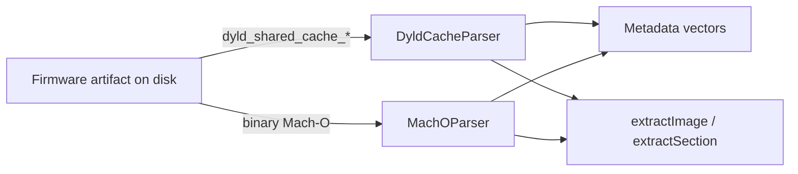

# Deep dive: DyldCacheParser and MachOParser

**Depth:** L5  
**Sources:** `src/DyldCacheParser.*`, `src/MachOParser.*`

Host-side **static analysis** helpers for firmware artifacts (shared cache dumps, single Mach-O binaries). They support research aligned with Pangu/TaiG and later patchfinding eras—not runtime jailbreak on device.

## Data flow



## DyldCacheParser

Models Apple’s **dyld shared cache** layout (prelinked system libraries on device).

**Structs:**

- `DyldCacheImageInfo` — path, address, inode/modTime metadata
- `DyldCacheMappingInfo` — VM/file mappings

**Public API:**

| Method | Returns |
|--------|---------|
| `isValid()` | Header/magic parsed |
| `getMagicString()` / `getArchitecture()` / `getUUID()` | Cache identity |
| `isSupportedVariant()` | `true` for classic `dyld_v0` / `dyld_v1` layouts |
| `getImageInfos()` / `findImage(path)` | Library catalog |
| `getMappings()` / `getBaseAddress()` | Layout |
| `extractImage(path, out)` | Copy Mach-O slice from cache (size via `MachOParser::computeMappedFileSize`) |

Private `CacheHeader` mirrors on-disk header fields in `DyldCacheParser.h`.

**Supported magics:** `dyld_v0` (armv7), `dyld_v1` with arch suffix (`arm64`, `arm64e`, `x86_64`, …).

**Unsupported / partial:** `dyld_v2` and newer driver-style caches — header may parse (`isValid`) but `isSupportedVariant()` is false; image walk may be incomplete. Always check both flags before trusting catalog output.

## MachOParser

Parses **Mach-O** executables/dylibs/kext-style objects.

**Enums:** `MachOCpuType` (ARM, ARM64, x86, x86_64), `MachOFileType` (EXECUTE, DYLIB, …).

**Structs:** `MachOSymtabInfo`, `MachODyldInfo`, `MachOSymbol`.

**Public API:**

| Method | Purpose |
|--------|---------|
| `is64Bit()`, `getCpuType()`, `getFileType()` | Header |
| `getSegments()` / `findSegment()` | `__TEXT`, `__DATA`, … |
| `getSections()` / `findSection()` | Section-level layout |
| `getLoadCommands()` | Raw load command blobs |
| `getSymtabInfo()` / `getSymbols()` | `LC_SYMTAB` + nlist walk |
| `getDyldInfo()` | `LC_DYLD_INFO` / `LC_DYLD_INFO_ONLY` regions |
| `getEntryPoint()` | Entry for executables (`LC_MAIN`) |
| `extractSection(seg, sect)` | Raw section bytes |
| `computeMappedFileSize(path, offset)` | On-disk Mach-O span (used by dyld cache extract) |

Private parsers walk `LC_SEGMENT` / `LC_SEGMENT_64`, nested sections, symtab, and dyld info commands.

**Magic / fat notes:** Accepts big-endian and little-endian thin magics. Universal (fat) headers use big-endian slice tables; pass `--arch arm32` or `--arch arm64` to select an ARM slice instead of the first architecture.

**Dyld cache:** `dyld_v0`/`dyld_v1`/`dyld_v2` magics; `isArm32Cache()` / `isArm64Cache()` normalize armv6/armv7 → arm32 and arm64/arm64e → arm64.

**Era note:**

- 32-bit Phoenix/Home Depot era → `MachOCpuType::ARM`
- arm64e / PAC era → still Mach-O; PAC does not change file format—analysis stays relevant for unc0ver/Electra-generation research

## Opaque analysis handles (ipswd-first)

CLI and library code use **opaque handles** that hide whether data came from **ipswd**, **ipsw** CLI, or the in-tree parsers:

| Type | Header | ipswd | ipsw CLI | Fallback |
|------|--------|-------|----------|----------|
| `MachOBinary` | `src/MachOBinary.h` | `GET /v1/macho/info` | `ipsw macho info --json` | `MachOParser` |
| `DyldSharedCache` | `src/DyldSharedCache.h` | `GET /v1/dsc/info` | `ipsw dyld info --json` | `DyldCacheParser` |

`IpswdClient` (`src/IpswdClient.*`) uses `curl` against `PURPLEPOIS0N_IPSWD` (default `http://127.0.0.1:3993/v1`).

`payloadJson()` / `--analyze-json FILE` exports the raw ipswd/ipsw JSON (for **boogeraids** and similar) or a minimal internal summary. `MachOParser::computeMappedFileSize` stays in-tree for dyld cache slice extraction.

**Submodule:** [blacktop/ipsw](https://github.com/blacktop/ipsw) at `external/ipsw` — `make external-ipswd` (daemon) and/or `make external-ipsw` (CLI). Override daemon URL with `PURPLEPOIS0N_IPSWD`, CLI with `PURPLEPOIS0N_IPSW`.

**boogeraids handoff:** See [BOOGERAIDS.md](../../BOOGERAIDS.md) for `--analyze-json` contract and shared `external/ipsw/ipsw` path.

## Wiring to performJailbreak()

Offline research entry points:

```bash
./build/bin/purplepois0n --analyze-binary /path/to/binary
./build/bin/purplepois0n --analyze-binary /path/to/fat --arch arm64
./build/bin/purplepois0n --analyze-dyldcache /path/to/dyld_shared_cache_arm64
./build/bin/purplepois0n --analyze-binary /bin/ls --analyze-json /tmp/macho.json
./build/bin/purplepois0n --analyze-backup /path/to/backup
tests/run_fixtures.sh   # mbdb + Manifest.db fixtures (no device)
```

## Legacy comparison (study vs in-tree)

| Area | Legacy study path | purplepois0n |
|------|-------------------|--------------|
| Manifest.mbdb | `OpenJailbreak/libmbdb`, `legacy/Chronic-Dev/absinthe-2.0` | `MbdbParser`, `MobileBackup` |
| Manifest.db | idevicerestore / libimobiledevice backups | `ManifestDbParser`, `KeyedArchiverPlist` |
| Mach-O / symbols | apparition, Chronic-Dev tooling, **ipswd/ipsw** | `MachOBinary` → ipswd, ipsw, or `MachOParser` |
| dyld cache | Community firmware dumps, **ipswd/ipsw** | `DyldSharedCache` → ipswd, ipsw, or `DyldCacheParser` |
| Backup restore | absinthe staging | **NOT** — parse-only per [SUPPORT.md](../../SUPPORT.md) |

Expected integration pattern for contributors:

1. Extract binary or cache from device via `AFCService` / IPSW / research share.
2. Run parser offline or in a future `analyze` subcommand.
3. Feed addresses/symbols into a separate exploit module hooked from `performJailbreak()`.

## Public format references

- Apple open-source **dyld** and **cctools** headers (historical Mach-O definitions)
- Jonathan Levin / community *iOS Internals* series (cited on wikis—not reproduced here)
- Pangu Black Hat PDF (chapter 3 L6) — conceptual cache injection context only

## Related reading

- [normal-mode-afc-backup.md](normal-mode-afc-backup.md) — obtaining files from device
- Book chapters 3–5, 7 — L5 era mapping for parsers
