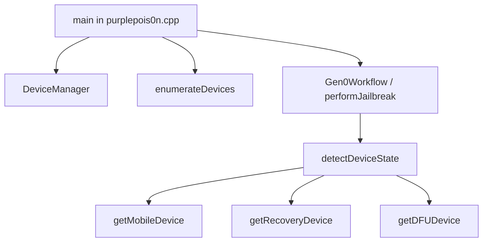

# Deep dive: DeviceManager

**Depth:** L5 (implementation tour)  
**Sources:** `src/DeviceManager.h`, `src/DeviceManager.cpp`, `src/IRecvUtil.h`, `include/DeviceState.h`, `src/purplepois0n.cpp`

`DeviceManager` is the central façade for “what is plugged in?” and “give me a handle for that mode.” Exploit logic is intentionally **outside** this class; `performJailbreak()` and `Gen0Workflow` call into it first.

## Role in the CLI

- `-l` / `--list` → `enumerateDevices()` — shows mode, hex ECID, CPID when available.
- `--gen0` / default jailbreak → `Gen0Workflow` → `detectDeviceState()` then mode-specific getters.

## DeviceState

Defined in `include/DeviceState.h`:

| Value | Meaning |
|-------|---------|
| `Unknown` | No recognized USB attachment |
| `Normal` | Booted iOS, usbmux/Lockdown |
| `Recovery` | Recovery / iBoot USB personality |
| `DFU` | DFU bootrom stage |

## Detection order (priority)

`detectDeviceState()` probes **DFU → Recovery → Normal** (lowest-level first). Rationale: during USB transitions, prefer the mode with the smallest running OS surface.

Private probes use `irecv_open_with_ecid` via `IRecvUtil::openWithEcidRetry` and `irecv_get_mode()`:

| Method | Distinguishes |
|--------|---------------|
| `tryOpenDFUDevice()` | `irecv_util::isDfuMode()` |
| `tryOpenRecoveryDevice()` | `irecv_util::isRecoveryMode()` |
| `tryOpenNormalDevice()` | libimobiledevice `idevice_new` |

## Enumeration

`enumerateDevices()` builds a `std::vector<DeviceInfo>`:

1. **Normal:** `idevice_get_device_list` → per-UDID `MobileDevice` for type + `ProductVersion`.
2. **Recovery:** irecv client → `fillIrecvDeviceInfo()` when mode is Recovery.
3. **DFU:** irecv client → `fillIrecvDeviceInfo()` when mode is DFU.

`DeviceInfo` fields: `udid`, `ecid`, `cpid`, `state`, `deviceType`, `firmwareVersion`. ECID and CPID are populated for DFU/Recovery via `irecv_get_device_info()` and serial parse fallbacks in `IRecvUtil`.

`getRecoveryEcid()` walks enumerated Recovery entries, then falls back to `irecv_util::probeRecoveryEcid()`.

## IRecvUtil (shared host I/O)

| Helper | Purpose |
|--------|---------|
| `openWithEcidRetry()` | 10× / 1s retry on `irecv_open_with_ecid` |
| `ecidFromClient()` / `cpidFromClient()` | Device identity from modern libirecovery |
| `usbMemoryRead()` / `usbMemoryWrite()` | 32-bit USB address split (wValue/wIndex) |

Modern libirecovery uses `irecv_client_t` and `<libirecovery.h>` (not legacy `irecv.h` / `irecv_device_t*` client handles).

## Factory methods

| API | Returns |
|-----|---------|
| `getMobileDevice(udid)` | `unique_ptr<MobileDevice>` or `nullptr` |
| `getRecoveryDevice(ecid)` | `unique_ptr<RecoveryDevice>` or `nullptr` |
| `getDFUDevice()` | `unique_ptr<DFUDevice>` or `nullptr` |

## Remaining gaps

| Historical need | purplepois0n today |
|-----------------|-------------------|
| Multiple simultaneous DFU devices | First match via `irecv_open_with_ecid(0)` |
| `IRECV_PROGRESS` on long uploads | `IRecvProgressSubscription` + optional `DFUDevice` callback; `sendFile()` |
| iTunes/Finder USB contention | Not handled |

## Related reading

- [dfu-recovery.md](dfu-recovery.md) — irecv memory/command helpers
- [primitives-gen0.md](primitives-gen0.md) — Gen0 + ChainRunner
- [normal-mode-afc-backup.md](normal-mode-afc-backup.md) — Lockdown + AFC
