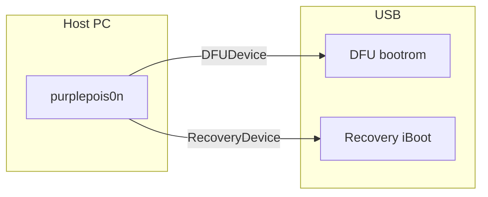

# Deep dive: DFU and Recovery paths

**Depth:** L5  
**Sources:** `src/DFUDevice.h`, `src/RecoveryDevice.h`, `src/IRecvUtil.*`, libirecovery (system dependency)

Both classes wrap **libimobiledevice libirecovery** (`irecv_*` on `irecv_client_t`) for USB communication while the device is not in full iOS. They mirror APIs greenpois0n / checkra1n-era host tools used conceptually—purplepois0n stops at transport primitives unless `-m` delegates to external checkm8 tools.

## Mode comparison



| Class | Boot stage | Typical historical use |
|-------|------------|------------------------|
| `DFUDevice` | Bootrom / DFU | limera1n, SHAtter, checkm8, IMG3 upload |
| `RecoveryDevice` | iBoot recovery | iBoot commands, ramdisk load, restore helpers |

`DeviceManager` uses `irecv_get_mode()` via `IRecvUtil` to avoid treating recovery as DFU.

## libirecovery API (modern)

Homebrew/system libirecovery 1.x uses:

- Header: `<libirecovery.h>` (not legacy `<irecovery.h>`)
- Client handle: `irecv_client_t`
- Open: `irecv_open_with_ecid(&client, ecid)` — ECID `0` matches any device
- Device info: `irecv_get_device_info()`, `irecv_devices_get_device_by_client()`

Shared helpers live in `src/IRecvUtil.h`.

## DFUDevice lifecycle

Construction opens via retry wrapper:

```cpp
irecv_util::openWithEcidRetry(&client, 0)
```

**Implemented surface:**

| Method | Purpose |
|--------|---------|
| `getSerialNumber`, `getDeviceType`, `getFirmwareVersion` | Identity (`IRecvUtil` + `irecv_getenv`) |
| `getCpid`, `getEcid` | Bootrom identifiers |
| `readMemory` / `writeMemory` | USB control transfers via `usbMemoryRead`/`Write` |
| `sendCommand` / `receiveResponse` | iBoot-style command channel (`irecv_recv_buffer`) |

Memory addresses use standard **32-bit USB encoding**: low 16 bits → `wValue`, bits 16–31 → `wIndex`. Works for both 32-bit (A4–A6) and 64-bit (A7+) bootrom targets in DFU.

**checkm8:** `Checkm8` classifies CPID (A5–A11), rejects A12+, and invokes **gaster** or **ipwndfu** when `-m` / `--checkm8` is set. USB exploit sequence remains external.

**Not in-tree:** IMG3/IM4P parsing, Pongo/KPF load, untether persistence.

**Progress (Phase 1.4):** Optional `IRECV_PROGRESS` via `IRecvProgressSubscription` + `DFUDevice(IRecvProgressCallback)`; use `DFUDevice::sendFile()` for long uploads. No default exploit payloads subscribe progress.

## RecoveryDevice lifecycle

Requires **ECID** at construction. Opens via `irecv_util::openWithEcidRetry(&client, ecid)`. API parallels `DFUDevice`.

**Gen0 integration:** `Gen0Workflow` calls `DeviceManager::getRecoveryEcid()` then `getRecoveryDevice(ecid)` — Recovery enumeration populates ECID for `-l` and `--gen0`.

## Jailbreak / checkm8 entry points

| CLI | DFU behavior |
|-----|--------------|
| `-j` / default | Probe chain only (`Checkm8BootromPrimitive`) |
| `-m` / `--checkm8` | Probe then external gaster/ipwndfu |
| `--gen0` | Full Gen0 scaffold + ChainRunner |

Flow for `-m`: probe CPID/ECID → release USB → `gaster pwn` or `python3 ipwndfu -p` → verify `PWND:` in serial.

## Public references

- **libirecovery:** https://github.com/libimobiledevice/libirecovery
- **ipwndfu / checkm8:** https://github.com/axi0mX/ipwndfu (study only; external execution)

## Safety note

`writeMemory` can brick hardware if misused. Prefer read-only probes until exploit modules are reviewed separately.

## Related reading

- [device-manager.md](device-manager.md) — mode detection, ECID enumeration
- [primitives-gen0.md](primitives-gen0.md) — DFU probe chain
- Book chapter 0 (greenpois0n), chapter 6 (checkra1n)
