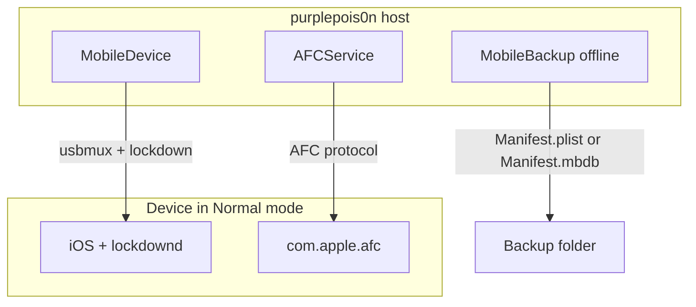

# Deep dive: Normal mode, AFC, and MobileBackup

**Depth:** L5  
**Sources:** `src/MobileDevice.h`, `src/AFCService.h`, `src/MobileBackup.h`, `src/MobileBackup.cpp`, `src/Gen0Workflow.cpp`

These components cover **booted iOS** host interaction: Lockdown queries, sandboxed file conduit, and offline backup *analysis*—the layers Absinthe-era tools used conceptually without implementing backup weaponization in-tree.

**Support matrix:** [SUPPORT.md](../../SUPPORT.md) — absinthe-era restore/staging is **NOT** in-tree; parse-only via CLI `--analyze-backup` and `MobileBackup` APIs.

## Architecture

## MobileDevice (Lockdown)

Header-only implementation in `MobileDevice.h` (`.cpp` is a stub).

| Capability | API | Backend |
|------------|-----|---------|
| Connect | ctor (first device or UDID) | `idevice_new` / `idevice_new_with_options` |
| Identity | `getDeviceName`, `getDeviceType`, `getUDID` | libimobiledevice |
| Plist keys | `getValue` / `setValue` | lockdownd handshake |
| Apps | `getInstalledApplications` | `instproxy` browse, user apps only |

Trust/unlock requirements are documented in class comments—same constraints as iTunes/Finder pairing.

**Gen 0 Normal branch** (`Gen0Workflow.cpp`): connects with `getMobileDevice`, prints device metadata, and logs that absinthe-style backup restore / userland chains are **not** implemented. Use `--analyze-backup PATH` for offline manifest research.

Historical mapping: evasi0n, Pangu, yalu, unc0ver, Dopamine—**userland/semi-untether** flows start here (or via sideloaded apps, which still need normal-mode USB for many host helpers).

## AFCService (file transfer)

Construct with UDID → `afc_client_new`.

| Method | Direction |
|--------|-----------|
| `uploadFile(local, remote)` | Host → device |
| `downloadFile(remote, local)` | Device → host |

64 KiB chunked I/O in header implementation. No directory listing or jailbreak-specific paths in-tree—callers choose remote paths after their own policy checks.

**Era relevance:** Post-jailbreak artifact pull, log collection, research payloads—not AFC-based kernel exploit delivery in this repo.

## MobileBackup (offline parser)

`MobileBackup` reads an **existing** backup directory on the host (`MobileBackup.cpp`, `MbdbParser.cpp`):

1. Detect manifest index: `Manifest.db` (v2) → `Manifest.mbdb` (v1) → `Manifest.plist` (v1).
2. Read `Status.plist` Version for storage layout: **2.x = flat paths**, **3.x+ = sharded paths** (`BackupProtocol`).
3. `parseInfoPlist()` for device metadata.
4. `parseManifest()` → unified `BackupFileInfo` list keyed by domain/path/SHA1 hash.

| Manifest | Parser | Era |
|----------|--------|-----|
| `Manifest.plist` | libplist `Files` dict | iOS 4+ |
| `Manifest.mbdb` | `MbdbParser` | absinthe / iOS 5–9 |
| `Manifest.db` | `ManifestDbParser` | iOS 10+ |

| API | Use |
|-----|-----|
| `getManifestTypeName` | CLI `--analyze-backup` output |
| `getFilesByDomain` | e.g. `HomeDomain`, `SystemPreferencesDomain` |
| `findFile` / `extractFile` | Research extraction (requires hash on disk) |
| `isEncrypted` | Detect encrypted backups |

Fixture: `tests/fixtures/mbdb_minimal/`, `manifest_db_minimal/`, `manifest_db_keyed/` — run `--analyze-backup` without a device.

`Manifest.db` `file` BLOBs are parsed via `KeyedArchiverPlist` (plain dict or NSKeyedArchiver `$objects` walk).

## Absinthe boundary (parse vs restore)

| Absinthe-era step | Historical tool | purplepois0n |
|-------------------|-----------------|--------------|
| Build malicious backup plist / domains | yes | **NOT** — no generation |
| Trigger iTunes/mobilebackup2 restore | yes | **NOT** — no restore service |
| On-device web clip / VPN trigger | yes | **NOT** |
| Inspect existing backup after the fact | forensic | **`--analyze-backup`**, `MobileBackup` |
| AFC file push after compromise | yes | **`AFCService`** API only |

Absinthe used backup *restore* as delivery; this repo only **parses** on-disk backups for analysis. No restore, staging, or weaponized plist generation. See [SUPPORT.md](../../SUPPORT.md).

## Dependencies (public)

- **libimobiledevice:** https://libimobiledevice.org — usbmux, lockdown, AFC, installation_proxy.
- **usbmuxd:** User-space USB multiplexing on macOS/Linux (Apple documents pairing in support articles; libimobiledevice is the open stack).
- **Backup format:** Community references on The iPhone Wiki “iTunes Backup”; Apple does not publish a full spec—treat field meanings as best-effort.

## Related reading

- [device-manager.md](device-manager.md) — `getMobileDevice` factory
- [binary-parsers.md](binary-parsers.md) — Mach-O/dyld after files are extracted
- Book chapter 1 (Absinthe) — L4 backup architecture, L5 `MobileBackup`
