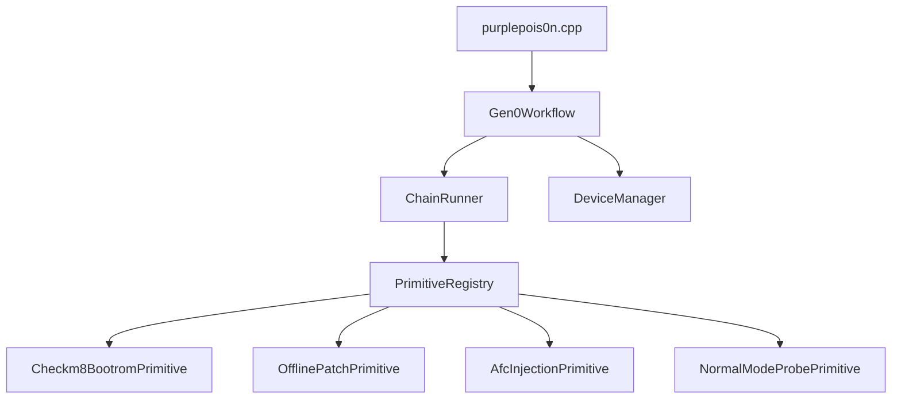

# Deep dive: Primitive framework and Gen0 workflow

**Depth:** L5  
**Sources:** `include/primitives/`, `src/primitives/`, `src/Gen0Workflow.cpp`, `src/purplepois0n.cpp`

The primitive layer is purplepois0n’s **probe-first research driver**: categorize host capabilities (Bootrom, Kernel, Codesign, Sandbox, Injection), run them through a shared `ChainRunner`, and export JSON reports—without bundling exploit bytes by default.

## Architecture

## Two-axis taxonomy

| Axis | Values |
|------|--------|
| **Category** | Bootrom, Kernel, Codesign, Sandbox, Injection |
| **Operation** | Read, Write, Overwrite, Patch, Inject, Execute, Probe |

Default policy: **Probe only**. Mutating operations require `make plugins` (`PURPLEPOIS0N_ENABLE_EXPLOIT_PLUGINS`) **and** CLI mutation (`-m` / `allowMutation` in context). No bundled exploit payloads in-tree.

## ChainRunner stages

`ChainRunner::runProbeChain()` executes:

1. **Detect** — device mode from `ExecutionContext`
2. **Connect** — attach transport (`DfuTransport`, `RecoveryTransport`, or Normal probes)
3. **Probe** — run registered primitives whose `canRun()` passes
4. **Report** — aggregate results; optional `--report FILE` JSON export

## Built-in primitives (registry)

| Primitive | Category | Typical mode |
|-----------|----------|--------------|
| `Checkm8BootromPrimitive` | Bootrom | DFU — CPID/ECID probe; exploit only with `-m` |
| `OfflinePatchPrimitive` | Codesign | Offline — no bundled patterns |
| `AfcInjectionPrimitive` | Injection | Normal — AFC reachability probe |
| `NormalModeProbePrimitive` | Injection | Normal — installed app count |

## Gen0Workflow entry points

| API / CLI | Behavior |
|-----------|----------|
| `--gen0` | `runGen0Jailbreak()` — mode-aware scaffold + probe chain |
| `--gen0 --analyze-backup PATH` | Normal branch runs `MobileBackup` analysis |
| `--report FILE` | Writes `ChainRunner` JSON after probe chain |
| `-j` (default) | DFU: probe only; other modes: Gen0 workflow |
| `-m` / `--checkm8` | DFU: probe then external gaster/ipwndfu |

Recovery path uses `DeviceManager::getRecoveryEcid()` before opening `RecoveryDevice(ecid)`.

## Key files

| Path | Role |
|------|------|
| `include/primitives/Primitives.h` | Umbrella include |
| `include/primitives/ChainRunner.h` | Stage orchestration + report writer |
| `include/primitives/PrimitiveRegistry.h` | Built-in registration |
| `src/Gen0Workflow.cpp` | Mode branches + honest gap logging |
| `src/IRecvUtil.*` | libirecovery open retry, ECID/CPID helpers, USB memory encoding |

## Related reading

- [device-manager.md](device-manager.md) — enumeration and ECID
- [dfu-recovery.md](dfu-recovery.md) — irecv transports
- [normal-mode-afc-backup.md](normal-mode-afc-backup.md) — Normal-mode probes
- [SUPPORT.md](../../SUPPORT.md) — honest capability matrix
- [legacy/INTEGRATION_PLAN.md](../../legacy/INTEGRATION_PLAN.md) — Phase 3 acceptance
