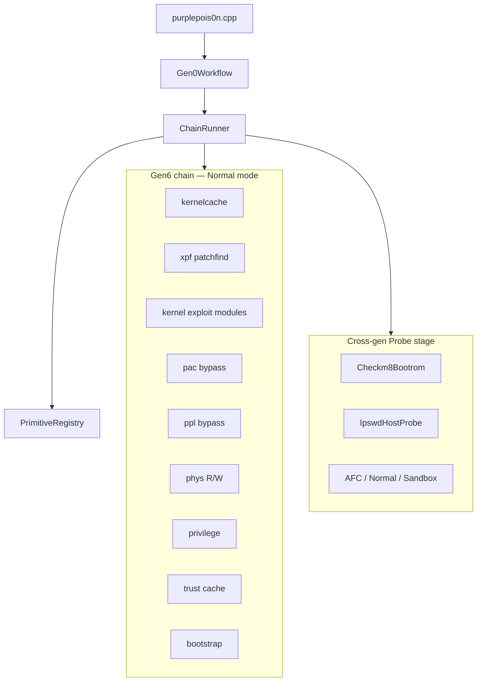

# Deep dive: Primitive framework and Gen0 workflow

**Depth:** L5  
**Sources:** `include/primitives/`, `src/primitives/`, `src/Gen0Workflow.cpp`, `legacy/modern-era/Dopamine/` (mirror)

The primitive layer is purplepois0n’s **probe-first research driver**. **Generation 0–5** use the classic five-category model; **Generation 6 (Dopamine 2.x)** adds a **Dopamine-shaped chain** with distinct exploit modules and post-kernel stages.

## Architecture

## Taxonomy (two layers)

### Layer 1 — Categories (`PrimitiveCategory`)

| Category | Dopamine analogue | Role |
|----------|-------------------|------|
| **Bootrom** | — | checkm8 / DFU (Gen 5) |
| **Kernel** | `EXPLOIT_TYPE_KERNEL` | kfd, weightBufs, multicast_bytecopy, DarkSword |
| **PacBypass** | `EXPLOIT_TYPE_PAC` | badRecovery |
| **PplBypass** | `EXPLOIT_TYPE_PPL` | dmaFail |
| **Patchfinding** | XPF / kernelcache | Offline host + on-device patchfind |
| **PhysRw** | `buildPhysRWPrimitive` | libjailbreak phys map |
| **Privilege** | `elevatePrivileges` | root, unsandbox, platformize |
| **TrustCache** | `loadBasebinTrustcache` | BaseBin trust cache |
| **Bootstrap** | launchdhook + `/var/jb` | Procursus / BaseBin install |
| **Codesign** | — | Offline patch, `codesign-signing-probe`, ipsw `macho sign` |
| **Sandbox** | — | Staging boundary probes |
| **Injection** | — | AFC, Normal lockdown, `sideload-install` (instproxy) |

### Layer 2 — Operations (`PrimitiveOperation`)

Read, Write, Patch, Inject, Execute, **Probe** (default).

Mutating ops require `make plugins` + mutation enabled. Gen6 exploit modules **probe** by default; with `PURPLEPOIS0N_DOPAMINE_EXPLOITS` set they `dlopen` the matching Dopamine framework and call `exploit_init(flavor)` / `exploit_deinit()` (execute picks highest-priority module per stage).

## Gen6 chain stages (`ChainStage`)

Normal-mode `--gen0` runs an **era-trimmed** chain via `runEraChain()` (Gen 6 full path on iOS 15+; Classic on iOS 6–14; Gen 5 DFU mini-chain when applicable) **before** the generic Probe stage:

| Order | Stage | Primitives |
|-------|-------|------------|
| 1 | **Kernelcache** | `gen6-kernelcache` |
| 2 | **Patchfind** | `gen6-xpf` |
| 3 | **KernelExploit** | `gen6-kfd`, `gen6-darksword`, `gen6-weightbufs`, `gen6-multicast-bytecopy` (priority order) |
| 4 | **PacBypass** | `gen6-badrecovery` |
| 5 | **PplBypass** | `gen6-dmafail` |
| 6 | **PhysRw** | `gen6-physrw` |
| 7 | **Privilege** | `gen6-privilege` |
| 8 | **TrustCache** | `gen6-trustcache` |
| 9 | **Bootstrap** | `gen6-bootstrap` |
| — | **Probe** | Bootrom (DFU), ipswd, AFC, Normal, Sandbox, codesign/sideload probes, backup summary |

Host sign → install → trust cache workflow: [sideload-codesign.md](sideload-codesign.md).

DFU mode runs Gen5 mini-chain when checkm8 CPID detected; otherwise Bootrom + generic probes only.

Classic chain (Gen 0–4 Normal): Kernelcache → Patchfind → KernelExploit → Privilege → Bootstrap — skips PAC/PPL/PhysRw/TrustCache.

## Exploit modules (`ExploitModulePrimitive`)

Mirrors Dopamine `DOExploit` — probe logs upstream paths; execute loads `{Frameworks}/{name}.framework/{name}` via `ExploitDelegate` when env is configured.

| Env | Purpose |
|-----|---------|
| `PURPLEPOIS0N_DOPAMINE_EXPLOITS` | Root of built framework bundles |
| `PURPLEPOIS0N_DOPAMINE_FLAVOR` / `PURPLEPOIS0N_DOPAMINE_FLAVOR_KFD` | `exploit_init` flavor (`physpuppet`, `smith`, `landa` for kfd) |
| `PURPLEPOIS0N_DOPAMINE_KFD` (etc.) | Direct dylib path override per module |
| `PURPLEPOIS0N_LIMERA1N` | Gen 0 limera1n delegate |
| `PURPLEPOIS0N_24KPWN` | Gen 0 24kpwn / 0x24000 untether delegate (old-BR 3GS, iPod 2G) |
| `PURPLEPOIS0N_EVASI0N` | Gen 1 evasi0n delegate |
| `PURPLEPOIS0N_CHECKRA1N` | Gen 5 checkra1n delegate |
| `PURPLEPOIS0N_JB_HELPER` | External installer/bootstrap CLI |
| `PURPLEPOIS0N_JB_HELPER_ARGS` | Optional extra args for JB helper |

**Note:** Dopamine exploit frameworks are iOS arm64 — host-side `dlopen` fails unless you have a matching slice; typical use is on-device or with a cross-built helper binary.

| Name | Module ID | Kind | Priority |
|------|-----------|------|----------|
| `gen6-kfd` | kfd | Kernel | 800 |
| `gen6-darksword` | DarkSword | Kernel | 900 |
| `gen6-weightbufs` | weightBufs | Kernel | 600 |
| `gen6-multicast-bytecopy` | multicast_bytecopy | Kernel | 500 |
| `gen6-badrecovery` | badRecovery | PacBypass | 700 |
| `gen6-dmafail` | dmaFail | PplBypass | 750 |
| `gen0-limera1n` | Limera1n | Kernel (Gen 0) | 900 |
| `gen0-24kpwn` | Kpwn24k | Kernel (Gen 0 bootrom untether) | 880 |
| `gen1-evasi0n` | Evasi0n | Kernel (Gen 1–4) | 850 |
| `gen5-checkra1n` | Checkra1n | Kernel (Gen 5 DFU) | 950 |

Each logs upstream repo + Dopamine path + iOS support band when `ExecutionContext.iosVersion` is set.

## ExecutionContext (gating)

| Field | Use |
|-------|-----|
| `iosVersion` | Module support bands (numeric compare) |
| `productType` | Device gating / arm64e heuristic |
| `arm64e` | PAC bypass requirement hint |
| `udid` | Required for Gen6 exploit modules on Normal |
| `backupPath` | Triggers `BackupProbePrimitive` in Probe stage |
| `jailbreakGeneration` | Era selection for `runEraChain()` |

## Key files

| Path | Role |
|------|------|
| `include/primitives/Gen6Types.h` | Module IDs, iOS range helper |
| `include/primitives/ExploitModulePrimitive.h` | DOExploit-shaped base |
| `include/primitives/ExploitDelegate.h` | dlopen bridge (`exploit_init` / `exploit_deinit`) |
| `include/primitives/Gen6ExploitModules.h` | Six exploit frameworks |
| `include/primitives/Gen6PostExploitModules.h` | Six post-kernel stages |
| `include/primitives/HistoricalExploitModules.h` | Umbrella → `historical/Gen{0,1,5}HistoricalModules.h` |
| `include/primitives/historical/HistoricalExploitModuleBase.h` | Shared historical exploit module boilerplate |
| `include/primitives/pongo/PongoTypes.h` | `PongoOptions` ↔ `ExecutionContext` |
| `include/primitives/pongo/PongoChain.h` | `runPongoChain()` (probe + boot primitives) |
| `src/pongo/PongoDevice.{h,cpp}` | USB client for PongoOS (05ac:4141) |
| `src/pongo/PongoWorkflow.cpp` | `runPongoProbe` / `runPongoBoot` CLI entrypoints |
| `src/pongo/PongoBootHelpers.cpp` | KPF/ramdisk path resolution + file read |
| `src/Gen0Context.cpp` | `buildExecutionContext()` from `Gen0Options` |
| `src/Gen0CliOptions.cpp` | `gen0OptionsFromCli()` for `--gen0` / recovery / pongo |
| `include/EnvUtil.h` | `envFlagEnabled`, `truthyEnv`, shared env helpers |
| `include/primitives/JbHelperDelegate.h` | JB installer spawn |
| `include/primitives/BackupProbePrimitive.h` | Backup summary in chain |
| `src/primitives/ChainRunner.cpp` | `runEraChain()` + thin `runPongoMiniChain` delegate |
| `src/primitives/PrimitiveRegistry.cpp` | Sectioned `registerBuiltins()` (bootrom → Gen6 → historical → boot chain → host) |

## Related reading

- [tss-futurerestore.md](tss-futurerestore.md) — TSS signing, idevicerestore vs futurerestore process
- [MODERN_ERA_LEARNINGS.md](../../legacy/MODERN_ERA_LEARNINGS.md) — cloned Dopamine tree walkthrough
- [puaf-kfd-era.md](puaf-kfd-era.md) — PUAF / libkfd vocabulary
- [07-dopamine-rootless.md](../07-dopamine-rootless.md) — Chapter 7 era summary
- [BACKPORT_MATRIX.md](../../BACKPORT_MATRIX.md) — what can be backported to older generations
- [SUPPORT.md](../../SUPPORT.md) — capability matrix
