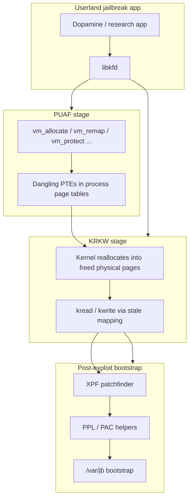

# Deep dive: PUAF, kfd, and the Dopamine 2 era

**Depth:** L5+ (extends [Chapter 7](../07-dopamine-rootless.md))  
**Sources:** public [kfd](https://github.com/felix-pb/kfd) / [opa334/kfd](https://github.com/opa334/kfd) README and write-ups; [Dopamine](https://github.com/opa334/Dopamine) release notes; community wiki summaries. **Full web bibliography:** [modern-era-web-sources.md](modern-era-web-sources.md).

**Educational boundary:** This document explains **architecture and vocabulary** for the physical use-after-free (PUAF) generation of kernel primitives. It does **not** reproduce trigger sequences, page counts, race timing, or offset tables.

## Era snapshot

From roughly **2023–2026**, many **rootless semi-untethered** jailbreaks on iOS 15–16 (and expanding 17–18 ranges on A12+) moved from one-off kernel bugs toward **composable primitive stacks**:

| Layer | Public name | Role |
|-------|-------------|------|
| **PUAF** | Physical use-after-free | Obtain **dangling page table entries (PTEs)** — user space still maps a virtual page while the kernel freed the backing physical page |
| **KRKW** | Kernel read / kernel write | Reallocate controlled kernel objects into those pages; read/write kernel memory via the stale mapping |
| **kfd** | “Kernel file descriptor” | [libkfd](https://github.com/felix-pb/kfd/blob/main/kfd/libkfd.h) library wrapping PUAF + KRKW behind `kopen()` / `kread()` / `kwrite()` / `kclose()` |
| **Bootstrap** | Dopamine 2.x, Procursus, ElleKit | Turn primitives into `/var/jb` rootless install, trust cache, tweak injection |

**Dopamine 1.x** (arm64e-focused, Fugu15 lineage) used **oobPCI**, **badRecovery**, **tlbFail**, and **CoreTrust** (CVE-2022-26763 … -26766 — see [Fugu15 wiki](https://theapplewiki.com/wiki/Fugu15) and [OBTS slides](https://objectivebythesea.org/v5/talks/OBTS_v5_lHenze.pdf)). **Dopamine 2.0+** (Feb 2024) broadened arm64 support and made **kfd / libkfd** the default kernel entry for many builds, with an in-app **exploit picker** and later alternatives (`weightBufs`, `multicast_bytecopy`, `DarkSword`).

## Conceptual data flow

### What “physical UAF” means here

Classic **use-after-free** bugs free an object but leave a pointer. **PUAF** (in kfd terminology) is the **virtual-memory analogue at the physical page layer**:

1. The kernel **releases** a physical page (or changes its ownership).
2. A **PTE in the attacking process** still maps user-visible virtual memory to that page (or a confused view of it).
3. The attacker **reallocates** different kernel content into the same physical frame.
4. Reads/writes through the dangling mapping become **arbitrary kernel memory access** once the right object lands in the page.

Public write-ups ([PhysPuppet](https://github.com/felix-pb/kfd/blob/main/writeups/physpuppet.md), [Smith](https://github.com/felix-pb/kfd/blob/main/writeups/smith.md), [Landa](https://github.com/felix-pb/kfd/blob/main/writeups/landa.md)) assume familiarity with XNU VM; purplepois0n does not duplicate them.

## libkfd public surface (conceptual)

From the kfd README — method **names only**, not tuning parameters:

| API | Purpose |
|-----|---------|
| `kopen(puaf_pages, puaf_method, kread_method, kwrite_method)` | Run PUAF + KRKW; returns opaque “kernel fd” on success |
| `kread(kfd, kaddr, uaddr, size)` | Kernel → user copy (like `copyout`) |
| `kwrite(kfd, uaddr, kaddr, size)` | User → kernel copy (like `copyin`) |
| `kclose(kfd)` | Tear down; some PUAF methods need careful cleanup to avoid panic on exit |

**PUAF methods** (enum `puaf_method`):

| Method | CVE (public) | Patched (representative) | Sandbox notes (public) |
|--------|--------------|--------------------------|-------------------------|
| `puaf_physpuppet` | CVE-2023-23536 | iOS 16.4 / macOS 13.3 | App sandbox; not WebContent |
| `puaf_smith` | CVE-2023-32434 | iOS 16.5.1 / macOS 13.4.1 | WebContent reachable; ITW reports |
| `puaf_landa` | CVE-2023-41974 | iOS 17.0 / macOS 14.0 | App sandbox; not WebContent |

Dopamine 2.x release notes mention **preferring PhysPuppet over Landa** where supported, and fixing picker UI so Smith / PhysPuppet are not offered on iOS versions they cannot serve.

**KRKW methods** (`kread_method`, `kwrite_method`) are documented in kfd’s [Exploiting PUAFs](https://github.com/felix-pb/kfd/blob/main/writeups/exploiting-puafs.md) write-up — separate from the vulnerability-specific PUAF paths.

## Dopamine 2.x architecture shifts

Beyond “call kfd”, Dopamine 2 rewrote host-facing and on-device architecture:

| Change | Effect |
|--------|--------|
| **Exploit picker** | User or heuristic selects kfd PUAF path (later: weightBufs, multicast_bytecopy, DarkSword) |
| **dmaFail** | PPL bypass (CVE-2023-38606, AGX MMIO) where applicable — pairs with kernel R/W |
| **XPF** replaces in-tree patchfinder | [opa334/XPF](https://github.com/opa334/XPF) — shared patchfinding library |
| **launchd hook** vs **jailbreakd** | Jailbreak state via launchd + XPC; deprecated long-lived daemon model |
| **Stateless kcall / trustcache** | Survive userspace reboot / jbupdate more cleanly (with caveats on primitive handoff) |
| **libroot** | [opa334/libroot](https://github.com/opa334/libroot) — rootless path helpers for tweaks |
| **libkrw** | Userland API wrapping kernel R/W; fixed across 2.0.x after early regressions |
| **PPLRW rewrite (1.x → 2.x)** | Map kernel physical address space for PPL work; multithreading / TLB fixes; changed jbupdate semantics |
| **TrollStore / sideload** | Install path less dependent on host PC; `libgrabkernel2` reduced beta-only constraints |

Post-kernel stages (still conceptual): **trust cache** management (`jbctl trustcache`), **codesign bypass**, **sandbox extensions**, **ElleKit** injection, **Procursus** bootstrap under `/var/jb`, **userspace reboot** instead of full reboot where possible. Host-side sign → install → trust-cache delegate workflow (no CoreTrust in-tree): [sideload-codesign.md](sideload-codesign.md).

## Later kernel options (Dopamine 2.1+)

Community-maintained exploit lists (e.g. [The Apple Wiki — Dopamine](https://theapplewiki.com/wiki/Dopamine)) name additional kernel modules bundled as picker options. **Upstream repos and CVEs:** [modern-era-web-sources.md §3](modern-era-web-sources.md#3-dopamine-2x--kernel-exploit-picker).

| Module | Upstream | CVE / bug (public) | Notes |
|--------|----------|-------------------|--------|
| **weightBufs** | [0x36/weightBufs](https://github.com/0x36/weightBufs) | CVE-2022-32845, -32948, -42805, -32899 (ANE) | [POC 2022 slides PDF](https://github.com/0x36/weightBufs/blob/main/attacking_ane_poc2022.pdf); Dopamine 2.1+ picker |
| **multicast_bytecopy** | [potmdehex/multicast_bytecopy](https://github.com/potmdehex/multicast_bytecopy) | CVE-2021-30937 | Original target iOS 15.0–15.1.1; adapted in Dopamine for broader ranges; [P0 #2224](https://bugs.chromium.org/p/project-zero/issues/detail?id=2224) |
| **dmaFail** | In Dopamine tree (Triangulation class) | **CVE-2023-38606** | PPL bypass (AGX MMIO); pairs with kernel R/W — [§2.5](modern-era-web-sources.md#25-dmafail--ppl-bypass-dopamine-2x) |
| **DarkSword** | [opa334/darksword-kexploit](https://github.com/opa334/darksword-kexploit) | Kernel R/W **CVE-2025-43520** (ITW) | [Google GTIG](https://cloud.google.com/blog/topics/threat-intelligence/darksword-ios-exploit-chain); 2.5+ arm64 17–18 (beta) |

These are **separate public projects** integrated into Dopamine’s picker — not part of libkfd’s three PUAF methods. Treat version support as **build-specific**; prefer [Dopamine releases](https://github.com/opa334/Dopamine/releases) over README for current ranges.

## Security engineering context

**Why PUAF mattered**

- **kalloc_type** and related heap hardening reduced classic inline overflow reliability.
- **PPL / PAC / SPTM** pushed privilege escalation toward **VM and page-table confusion** and **physical mapping** tricks.
- **SSV / rootless** moved persistence to `/var/jb` + bind mounts — host tools parse firmware; the phone runs the exploit.

**Defender view**

- Apple patched each PUAF CVE in point releases; jailbreak windows are **narrow per build**.
- Sandbox **reachability** (App vs WebContent) determined which bugs were usable from which app contexts.
- Exit paths matter: libkfd **sleeps before exit** on failure because some PUAF cleanups are panic-prone.

## Host tooling in the PUAF era

| Path | Role for purplepois0n-style research |
|------|--------------------------------------|
| **TrollStore / AltStore** | Install Dopamine IPA; not purplepois0n’s job |
| **usbmux + AFC** | Pull logs, crash reports, research files — [`AFCService`](../../../src/AFCService.h) |
| **IPSW / kernelcache offline** | [`MachOBinary`](../../../src/MachOBinary.h) / [`DyldSharedCache`](../../../src/DyldSharedCache.h) via **ipswd** / ipsw |
| **DFU / checkm8** | Unrelated lane for A8–A11 hardware (Chapter 6) |

The **host PC is optional** for many Dopamine installs; purplepois0n remains relevant for **firmware analysis**, **backup parse**, and **Normal-mode USB** when you do attach a trusted device.

## purplepois0n mapping

| Need | In-tree | Gap |
|------|---------|-----|
| Install / run Dopamine | — | **Out of scope** |
| libkfd / PUAF reproduction | — | **Out of scope** (see kfd repo + Apple security updates) |
| Kernel patchfinding (XPF) | — | **Out of scope** |
| Pull artifacts over USB | `MobileDevice`, `AFCService` | **Implemented** |
| Analyze kernelcache / dyld / Mach-O from IPSW | `MachOBinary`, `DyldSharedCache`, ipswd | **Implemented** |
| `performJailbreak()` Normal hook | scaffold | **Phase 6.7** — env delegate to external JB app; no libkfd in-tree |

**Research loop (documented, not automated in CLI):**

1. Extract `kernelcache*` + `dyld_shared_cache_*` from IPSW → `--analyze-dyldcache` / `--analyze-binary` / `--analyze-json`.
2. Study patchfinder symbols offline (ipsw, Ghidra, community notes) — parallel to what XPF automates on device.
3. Optional: AFC export of crash logs from device for correlation (no in-tree slide finder).

See also [BOOGERAIDS.md](../../BOOGERAIDS.md) for JSON handoff to sibling analysis tooling.

## Timeline (high level)

| When | Milestone |
|------|-----------|
| 2023 | kfd / libkfd public; PUAF write-ups (PhysPuppet, Smith, Landa) |
| 2023 | Dopamine 1.x — arm64e, Fugu15 fork, custom PPL path |
| 2024-02 | Dopamine **2.0** — arm64, kfd picker, XPF, launchd hook |
| 2024–2025 | Reliability work (memory hogging, PhysPuppet preference, arm64 fixes) |
| 2025–2026 | weightBufs, multicast_bytecopy, **DarkSword**; [2.5b3](https://github.com/opa334/Dopamine/releases/tag/2.5b3) arm64 **17.0–18.7.1** (beta) |

## Sources

**Complete web bibliography (repos, CVEs, talks, threat intel):** [modern-era-web-sources.md](modern-era-web-sources.md)

### Quick links

| Type | URL |
|------|-----|
| kfd (felix-pb) | https://github.com/felix-pb/kfd |
| kfd (opa334 fork) | https://github.com/opa334/kfd |
| Exploiting PUAFs (generic KRKW) | https://github.com/felix-pb/kfd/blob/main/writeups/exploiting-puafs.md |
| PhysPuppet / Smith / Landa write-ups | https://github.com/felix-pb/kfd/tree/main/writeups |
| Dopamine + releases | https://github.com/opa334/Dopamine · https://github.com/opa334/Dopamine/releases |
| XPF | https://github.com/opa334/XPF |
| Fugu15 OBTS slides | https://objectivebythesea.org/v5/talks/OBTS_v5_lHenze.pdf |
| Apple security (PhysPuppet / Smith / Landa) | HT213676 · HT213814 · HT213938 |
| Dopamine wiki | https://theapplewiki.com/wiki/Dopamine |
| Nullcon Goa 2025 (opa334) | https://www.youtube.com/watch?v=lU2lxGtLN6k |
| dmaFail / Triangulation (37C3) | https://www.youtube.com/watch?v=1f6YyH62jFE |
| Securelist — CVE-2023-38606 | https://securelist.com/operation-triangulation-the-last-hardware-mystery/111669/ |
| DarkSword GTIG | https://cloud.google.com/blog/topics/threat-intelligence/darksword-ios-exploit-chain |
| Support matrix (releases) | [modern-era-web-sources.md §3.1](modern-era-web-sources.md#31-dopamine-support-matrix-release-sourced) |

**Not in purplepois0n tree:** libkfd sources, Dopamine exploit binaries, XPF offset databases — see catalog [§10](modern-era-web-sources.md#10-remaining-gaps--intentionally-omitted).

**Not found (public web):** Peer-reviewed opa334 paper — use Nullcon 2025 video above.

**Legacy integration docs:** [LEARNINGS.md](../../legacy/LEARNINGS.md) · [GENERATIONS.md](../../GENERATIONS.md#generation-6-rootless-modern-era) · [Chapter 7](../07-dopamine-rootless.md)
