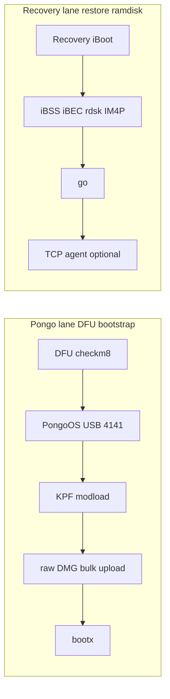

# Recovery ramdisk builder + multi-stage chain

Host-side custom HFS+ ramdisk creation without `hdiutil attach` or anthrax `template.dmg`. Artifacts are assembled in memory and written to disk at each stage.

**MVP integration:** The planner auto-resolves ramdisk from `PURPLEPOIS0N_IPSW` or `PURPLEPOIS0N_RAMDISK`; boot delivery is lane-agnostic. See [MVP.md](../../MVP.md).

## Phase A — In-memory HFS+ builder

| Module | Role |
|--------|------|
| `HfsPlusWriter` | Minimal HFS+ volume creator (flat catalog, no journaling/ACLs) |
| `RamdiskBuilder` | Overlay directory walk → in-memory volume |
| `RamdiskInspector` | H+ magic check at offset 1024 |

```bash
./build/bin/purplepois0n --build-ramdisk /tmp/test.dmg \
  --ramdisk-overlay tests/fixtures/ramdisk_overlay
```

Verify with bundled ipsw:

```bash
./external/ipsw/ipsw disk hfs /tmp/test.dmg
```

Defaults: 16 MiB, 4096-byte blocks, label `purplepois0n`. Override with `--ramdisk-size`, `--ramdisk-label`.

**Policy:** no bundled jailbreak payloads — user supplies `--ramdisk-overlay` only.

## Phase B — IPSW rdsk mutate + IM4P repack

`RamdiskPackager` delegates binary transforms to **ipsw** (same pattern as `CodesignDelegate`):

1. `ipsw extract --dmg rdisk` — locate RestoreRamDisk
2. `ipsw img4 im4p extract` — unwrap to HFS+ bytes
3. Overlay merge: extract stock tree via `ipsw disk hfs`, union overlay + `--ramdisk-add`, rebuild in-memory volume
4. `ipsw img4 im4p create --type rdsk --compress lzss`
5. Personalize via `TssDelegate::personalizeComponent(..., "RestoreRamDisk")`

```bash
./build/bin/purplepois0n --ramdisk-from-ipsw --ipsw firmware.ipsw \
  --ramdisk-overlay ./my-overlay --output /tmp/ramdisk.im4p
```

Scratch dir: `--ramdisk-work-dir` or `/tmp/pp-ramdisk-<pid>` (`PURPLEPOIS0N_RAMDISK_WORK_DIR`).

## Phase C — Recovery multi-stage chain

`RecoveryBootChainPrimitive` orchestrates **iBSS → iBEC → rdsk** with probe-first / execute-gated semantics.

```bash
# Probe (no upload)
./build/bin/purplepois0n --gen0 --recovery-chain --ipsw firmware.ipsw --report /tmp/pp.json

# Execute uploads (requires make plugins + Recovery device)
./build/bin/purplepois0n --gen0 --recovery-execute --ipsw firmware.ipsw \
  --apticket blob.shsh2 --ramdisk-overlay ./overlay
```

Environment:

| Variable | Purpose |
|----------|---------|
| `PURPLEPOIS0N_RECOVERY_BOOT` | `go` after rdsk upload (default on execute; set `0` to skip) |
| `PURPLEPOIS0N_RECOVERY_RESET` | `irecv_reset` after each stage (default on) |
| `PURPLEPOIS0N_RECOVERY_REBOOT` | Optional reboot after final stage |
| `PURPLEPOIS0N_RECOVERY_CHAIN` | Enable chain probe when set |

**Honest boundaries:**

- Boot command (`go`) runs on `--recovery-execute` unless `PURPLEPOIS0N_RECOVERY_BOOT=0`
- KPF / checkra1n jailbreak bootstrap — user-supplied KPF + optional `--pongo-boot` (separate from Recovery)
- No in-tree armv6 `launchd`, AFC2, or exploit bytes

## Generic boot delivery (lanes)

Ramdisk upload and optional post-loader modules (KPF today; other payloads later) are **independent**. A ramdisk artifact does not imply any particular exploit or boot module.

| Flag | Purpose |
|------|---------|
| `--ramdisk PATH` | Boot artifact only (`.dmg` raw HFS+ or `.im4p` signed rdsk) |
| `--boot-lane LANE` | `auto`, `recovery`, `usb-loader`, `post-exploit`, `live-agent` |
| `--boot-module PATH` | Optional post-loader blob (required for `usb-loader` today) |
| `--boot-args LINE` | Optional kernel boot-args (transport default when omitted) |

Core resolver: `resolveBootDelivery()` / `resolveRamdiskArtifactPath()` in `RamdiskDelivery.cpp`. Lane dispatch: `runBootDeliveryChain()` → `usb-loader-boot-chain`, `recovery-boot-chain`, or `ramdisk-shell`.

Legacy `--pongo-*` flags remain aliases for the `usb-loader` lane. Pongo-specific USB protocol code lives in `PongoDevice.cpp` only.

## Pongo vs Recovery

On checkm8-capable hardware (A5–A11), host tools use **two parallel boot lanes**. purplepois0n implements both at the transport/primitive layer; neither replaces a full jailbreak app.



| Goal | Use | purplepois0n flags |
|------|-----|-------------------|
| Custom restore ramdisk + host exec | Recovery → `go` | `--recovery-chain`, `--recovery-execute`, `--ramdisk-overlay` |
| Jailbreak bootstrap (KPF + optional custom DMG) | Pongo shell after checkra1n | `--pongo-probe`, `--pongo-boot`, `--pongo-kpf`, `--pongo-execute` |
| SEP-assisted IPSW decrypt (research) | Pongo `sep decrypt` | bundled `ipsw pongo` (Go + libusb) |
| Stock restore / futurerestore | lockdown / restored | **Not in-tree** |

**Recovery path** personalizes signed IM4P components via TSS and uploads through **libirecovery**. Custom overlay DMGs from `RamdiskPackager` are wrapped as `RestoreRamDisk` IM4P before upload.

**Pongo path** expects a **raw HFS+ `.dmg`** and a **user-supplied KPF blob** over USB bulk (checkra1n `boot-checkra1n.py` sequence). Build the DMG with `--build-ramdisk` or `--ramdisk-from-ipsw` (use the intermediate `.dmg`, not the IM4P). Device must already be at the Pongo shell (`checkra1n -cp` or `--pongo-spawn-checkra1n`).

| Variable | Purpose |
|----------|---------|
| `PURPLEPOIS0N_PONGO_PROBE` | Enable `pongo-probe` in `--gen0` |
| `PURPLEPOIS0N_PONGO_BOOT` | Enable `pongo-boot-chain` probe |
| `PURPLEPOIS0N_KPF` | Path to checkra1n KPF blob for `--pongo-boot` |
| `PURPLEPOIS0N_CHECKRA1N` | checkra1n binary for `--pongo-spawn-checkra1n` |
| `PURPLEPOIS0N_PONGO_XARGS` | Override xargs line (default `xargs serial=3 rootdev=md0`) |

Requires **libusb** at build time (`brew install libusb`; auto-detected like libtatsu). Without libusb, Pongo primitives log a stub message and return `PrerequisitesMissing`.

## vs anthrax

| anthrax | purplepois0n |
|---------|--------------|
| `template.dmg` + `hdiutil attach` | Pre-sized in-memory volume |
| Bundled `files/` payloads | `--ramdisk-overlay` only |
| `xpwntool` IMG3 | ipsw IM4P/IMG4 (`rdsk`, lzss) |

See also [dfu-recovery.md](dfu-recovery.md), [tss-futurerestore.md](tss-futurerestore.md).

## Phase D — Live host↔ramdisk communication

**Stock IPSW `RestoreRamDisk` does not ship a user shell agent.** After boot, Apple’s restore ramdisk talks to the host through **lockdown / `restored`** (the same path `idevicerestore` uses). purplepois0n does not implement that restore FSM today.

For **host-driven upload + command execution**, build a **custom overlay** and stage arm64 binaries from your Mac at build time. You choose the runtime agent — a small TCP listener, dropbear, netcat glue, etc. purplepois0n does not bundle those binaries.

| Ramdisk source | Live upload / exec |
|----------------|-------------------|
| Stock IPSW rdsk (no overlay) | **No** — restore protocol only |
| Custom overlay + user agent | **Yes** — TCP (default) or SSH |

### Staging host files at build time

```bash
./build/bin/purplepois0n --build-ramdisk /tmp/test.dmg \
  --ramdisk-overlay ./overlay \
  --ramdisk-add ./files/config.txt:/etc/pp.conf \
  --ramdisk-add-macho ./build/pp-agent:/sbin/pp-agent
```

`--ramdisk-add-macho` verifies an arm64 Mach-O slice exists (macOS arm64 ≠ iOS — cross-compile or use an iOS-built binary).

### TCP line protocol (default transport)

After a **custom** ramdisk boots, the device re-enumerates on **usbmux**. Forward the agent port with **iproxy**, then use probe/exec/push/pull:

```bash
# Auto iproxy when -d UDID is set (default TCP 4444:4444)
./build/bin/purplepois0n -d UDID --ramdisk-probe

./build/bin/purplepois0n -d UDID --ramdisk-exec "uname -a"
./build/bin/purplepois0n -d UDID --ramdisk-push ./tool /tmp/tool
./build/bin/purplepois0n -d UDID --ramdisk-pull /var/log/syslog /tmp/ramdisk.log
./build/bin/purplepois0n -d UDID --ramdisk-ls /

# Optional SSH when overlay ships sshd/dropbear
./build/bin/purplepois0n -d UDID --ramdisk-transport ssh --ramdisk-ssh-port 2222 \
  --ramdisk-device-port 22 --ramdisk-exec id
```

Agent contract (one connection per request):

| Host → device | Device → host |
|---------------|---------------|
| `PING` | `PONG` |
| `EXEC id` | `OK 0` + lines + `.` |
| `PUT /path N` + bytes | `OK` |
| `GET /path` | `DATA N` + bytes or `ERR msg` |

| Variable | Default | Purpose |
|----------|---------|---------|
| `PURPLEPOIS0N_RAMDISK_TRANSPORT` | tcp | `tcp` or `ssh` |
| `PURPLEPOIS0N_RAMDISK_TCP_PORT` | 4444 | Local forwarded TCP port |
| `PURPLEPOIS0N_RAMDISK_DEVICE_PORT` | 4444 / 22 | Device-side iproxy target |
| `PURPLEPOIS0N_RAMDISK_SSH_PORT` | 2222 | Local SSH port (transport=ssh) |
| `PURPLEPOIS0N_RAMDISK_SSH_PASS` | alpine | Password for sshpass |
| `PURPLEPOIS0N_RAMDISK_SSH_KEY` | — | Private key (preferred over password) |
| `PURPLEPOIS0N_RAMDISK_AUTO_IPROXY` | 1 | Spawn iproxy when `-d UDID` set |

`RamdiskShellPrimitive` runs in `--gen0` probe/execute when ramdisk flags or env are set.

**Boundaries:**

- Stock rdsk: no SSH; use `idevicerestore` / futurerestore for restore I/O (not in-tree FSM)
- Custom rdsk: SSH requires user-supplied sshd in `--ramdisk-overlay`
- Pre-boot iBoot: `RecoveryDevice::sendCommand` / `sendFile` only
- Interactive TTY: `ssh -p 2222 root@127.0.0.1` once overlay sshd is running
