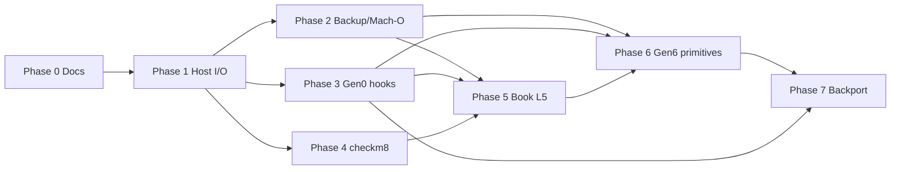
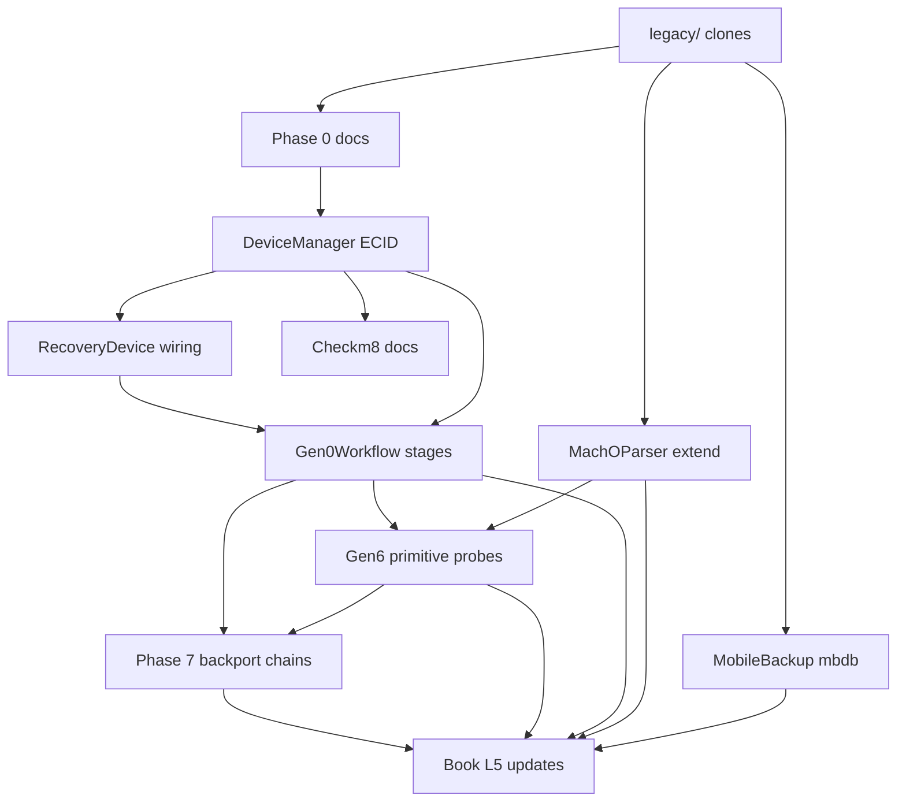

# Legacy integration plan

Phased roadmap for evolving purplepois0n using **read-only** lessons from [`legacy/`](../../legacy/). This plan ports **host I/O, parsers, and workflow scaffolding** only—not exploit blobs or weaponized backup staging.

**Inputs:** [LEARNINGS.md](LEARNINGS.md) · [REPO_INDEX.md](REPO_INDEX.md) · [SUPPORT.md](../SUPPORT.md) · [BACKPORT_MATRIX.md](../BACKPORT_MATRIX.md)

---

## Overview

| Phase | Priority | Effort | Depends on | Status (2026-06-03) |
|-------|----------|--------|------------|---------------------|
| 0 — Documentation | P0 | **Done / maintained** | legacy clone snapshot | Complete — see [PHASE_STATUS.md](PHASE_STATUS.md) |
| 1 — Host I/O parity | **P0** | 1–2 weeks | libirecovery (system) | **Complete** |
| 2 — Backup / Mach-O / mbdb | P1 | 2–3 weeks | Phase 1 optional | **Complete** (encrypted decrypt deferred) |
| 3 — Gen0 workflow hooks | P1 | 1 week | Phase 1 | **Complete** |
| 4 — checkm8 status | P2 | ongoing | external gaster/ipwndfu | **~90%** (hardware smoke optional) |
| 5 — Book chapter updates | P2 | 1 week | Phases 1–2 | **Complete** |
| 6 — Modern era primitives & host research | P1 | 2–3 weeks | Phases 2–3 | **In progress** |
| 7 — Backport & multi-generation chains | P1 | 2–4 weeks | Phases 3, 6 | **Planned** — [BACKPORT_MATRIX.md](../BACKPORT_MATRIX.md) |

---

## Phase 0: Documentation and reference linking

**Status:** **Complete** (ongoing maintenance — see [PHASE_STATUS.md](PHASE_STATUS.md))

### Goals

- Catalog legacy mirrors, study priorities, and honest capability gaps.
- Link book chapters and SUPPORT matrix to concrete legacy paths.
- Keep `docs/book/deep/` and `docs/legacy/*` aligned with `src/` when host I/O or Gen0 workflow changes.

### Tasks

- [x] `legacy/README.md` clone policy and snapshot counts
- [x] `docs/ARCHIVES.md` integration policy
- [x] `docs/legacy/LEARNINGS.md` synthesis
- [x] `docs/legacy/REPO_INDEX.md` repo table
- [x] `docs/legacy/INTEGRATION_PLAN.md` (this file)
- [x] `docs/legacy/COMPARISON_MATRIX.md`
- [x] `docs/legacy/PHASE_STATUS.md` — living phase rollup + `src/` → doc lookup
- [x] Cross-links in `docs/README.md`, book Ch. 0/1, `ARCHIVES.md`, `DEPTH.md`
- [x] `docs/book/deep/primitives-gen0.md` — ChainRunner / primitive framework tour
- [x] Refresh `docs/book/deep/device-manager.md` and `dfu-recovery.md` for modern libirecovery + ECID/retry

### Acceptance criteria

- Contributor can find **which legacy repo to read** for DFU, backup, or Mach-O work without cloning blindly.
- greenpois0n **empty submodule** caveat documented.

### Risks

| Risk | Mitigation |
|------|------------|
| Docs drift from `src/` | Update SUPPORT.md when phases land |
| Accidental exploit copy-paste | LEARNINGS "do not port" tables |

---

## Phase 1: Host I/O parity (DFU / Recovery / irecv)

**Priority:** P0 — **start here**

### Goals

Match **transport-quality** of Chronic-Dev libirecovery/idevicerestore usage: reliable ECID handling, mode detection, progress feedback, and Recovery open without ECID `0` fallback.

### Tasks

- [x] **1.1 ECID in enumeration** — Populate `DeviceInfo::ecid` for Recovery entries in `DeviceManager::enumerateDevices()` (mirror `irecv_get_ecid` already used for DFU branch).
- [x] **1.2 Recovery open path** — Wire `Gen0Workflow` / `performJailbreak()` Recovery branch to use enumerated ECID via `DeviceManager::getRecoveryEcid()` / `getRecoveryDevice(ecid)`.
- [x] **1.3 irecv retry loop** — Add bounded retry (10×, 1s sleep) on `irecv_open_with_ecid` / `irecv_open_device_with_ecid` via `IRecvUtil`.
- [x] **1.4 Progress callbacks** — `IRecvProgressSubscription` + optional `DFUDevice` callback; `sendFile()` for long uploads (API only; no default exploit uploads).
- [x] **1.5 CLI listing** — Extend `-l` output: mode, ECID (hex), CPID when available from serial parse.
- [x] **1.6 Unit/smoke tests** — Mock-free compile checks; manual DFU/Recovery device smoke script documented in SUPPORT.md.

### Acceptance criteria

- `-l` shows ECID for DFU **and** Recovery when device connected.
- `--gen0` opens `RecoveryDevice` without logging "ECID unknown" when irecv exposes ECID.
- No new exploit code; `SUPPORT.md` matrix unchanged for exploit rows.

### Risks

| Risk | Mitigation |
|------|------------|
| ECID `0` valid on pre-A4 hardware | Keep explicit override flag for research |
| libirecovery API differences vs syringe fork | Test against Homebrew/system libirecovery version pinned in README |
| USB race on macOS | Retry loop from idevicerestore |

### Recommended first task

**Task 1.1 — ECID in Recovery enumeration** (`DeviceManager.cpp`): smallest diff, unblocks Recovery workflow and matches Chronic-Dev assumption that Recovery handles are ECID-scoped.

---

## Phase 2: Backup / Mach-O / mbdb (absinthe-2.0 lineage)

**Priority:** P1

### Goals

Enhance offline research parsers to cover **iOS 5-era Manifest.mbdb** and deepen Mach-O/dyldcache parity with absinthe/apparition/libmbdb—without backup **restore** or malicious **generation**.

### Tasks

- [x] **2.1 Manifest.mbdb parser** — `MbdbParser` + auto-detect in `MobileBackup` (clean-room; study `OpenJailbreak/libmbdb`).
- [x] **2.1b Manifest.db parser** — `ManifestDbParser` (SQLite `Files` table, iOS 10+); detect order prefers db over mbdb/plist.
- [x] **2.2 Domain index parity** — Unified `BackupFileInfo` from mbdb and sqlite records (`domain`, `path`, `fileID` hash).
- [x] **2.3 Mach-O extensions** — `LC_SYMTAB`, `LC_DYLD_INFO`, symbol listing, BE magic fix, `computeMappedFileSize`.
- [x] **2.4 DyldCacheParser hardening** — Magic/arch variants, `isSupportedVariant`, cache slice extract via Mach-O size walk.
- [x] **2.5 CLI** — `--analyze-backup` reports manifest type (plist / mbdb / db) and record counts.
- [x] **2.6 Tests** — Fixtures at `tests/fixtures/mbdb_minimal/`, `manifest_db_minimal/`, `manifest_db_keyed/`.
- [x] **2.7 NSKeyedArchiver blobs** — `KeyedArchiverPlist` resolves Size/LastModified/Birth from Manifest.db `file` BLOBs.
- [x] **2.9 Backup protocol v1/v2** — `BackupProtocol` index (mbdb/plist vs Manifest.db) + storage layout (Status.plist 2.x flat vs 3.x sharded); mbdb format bytes 1 and 5.
- [x] **2.10 arm32/arm64 parsers** — Mach-O fat slice `--arch`; dyld cache arm32/arm64 detection; dyld_v0/v1/v2 magics.
- [x] **2.11 CLI dyld cache** — `--analyze-dyldcache PATH` via `analyzeDyldCache()`.
- [x] **2.12 ipswd / ipsw opaque handles** — `MachOBinary` / `DyldSharedCache` prefer **ipswd** REST (`IpswdClient`, `GET /v1/macho/info`, `/v1/dsc/info`); fall back to `ipsw` CLI then in-tree parsers. `--analyze-json` exports raw JSON for boogeraids. See [BOOGERAIDS.md](../BOOGERAIDS.md).

### Deferred (not blocking Phase 2)

- **Encrypted backup decrypt** — `isEncrypted` detected; no keybag / Manifest key decrypt (documented in SUPPORT.md risks).

### Acceptance criteria

- `--analyze-backup` succeeds on **Manifest.mbdb** and **Manifest.db** fixture trees.
- `MobileBackup::getFilesByDomain` works for mbdb-backed backups.
- `--analyze-binary` / `--analyze-dyldcache` report `Backend: ipswd` when daemon is running (`make external-ipswd && ./external/ipsw/ipswd start`).
- Still **no** mobilebackup2 restore client.
- Still **no** encrypted backup decrypt.

### Risks

| Risk | Mitigation |
|------|------------|
| Encrypted mbdb backups | Document `isEncrypted` limitation; defer decryption |
| Encrypted Manifest.db | `Manifest.plist` + entry flags detected; no keybag decrypt |
| GPL absinthe code | Clean-room parser from format spec + libmbdb |
| Scope creep into weaponized mb2insert | Explicit non-goal in SUPPORT.md |

---

## Phase 3: Gen0 workflow hooks (without exploits)

**Priority:** P1

### Goals

Expand `Gen0Workflow` into a **mode-aware research driver**: structured steps, plugin callback points, honest logging—mirroring greenpois0n/absinthe **shape** without limera1n or absinthe staging.

### Tasks

- [x] **3.1 Workflow stages enum** — Detect → Connect → Probe → Report (no Exploit stage in default build).
- [x] **3.2 DFU probe** — Log CPID/BDID/serial fields; call `Checkm8::probe` without auto-pwn unless `-m`.
- [x] **3.3 Normal probe** — List installed apps count via `NormalModeProbePrimitive` / `MobileDevice::getInstalledApplications`.
- [x] **3.4 Backup hook** — If `--analyze-backup` passed with `--gen0`, run analysis in Normal branch.
- [x] **3.5 Contributor extension point** — Document `performJailbreak()` / primitive registry in root README (no default exploit registration).
- [x] **3.6 JSON/text report** — Optional `--report FILE` for automation.

### Acceptance criteria

- `--gen0` output is stage-labeled and references SUPPORT.md gaps by name.
- Default build never calls pois0n_inject / limera1n / backup restore.

### Risks

| Risk | Mitigation |
|------|------------|
| Users expect one-click JB | Keep WARN logs from current `Gen0Workflow.cpp` |
| Callback API becomes exploit loader | Gate behind compile flag `PURPLEPOIS0N_ENABLE_EXPLOIT_PLUGINS` default OFF |

---

## Phase 4: checkm8 (reference status)

**Priority:** P2 — largely **landed** as external delegation

### Goals

Document and stabilize checkm8 as **Gen 5 bridge** in Gen 0 DFU context; no in-tree USB exploit reimplementation.

### Current status (in-tree)

| Item | Status |
|------|--------|
| `Checkm8.cpp` CPID tables | Implemented |
| gaster / ipwndfu env invocation | Implemented |
| `-m` / `--checkm8` CLI | Implemented |
| In-tree USB exploit | **NOT planned** |
| Pongo / KPF / ramdisk | **NOT** |

### Tasks

- [x] **4.1** Document `PURPLEPOIS0N_GASTER` / `PURPLEPOIS0N_IPWNDFU` in root README with version pins.
- [x] **4.2** Cross-link `legacy/OpenJailbreak/ipwndfu` in LEARNINGS (study only).
- [x] **4.3** After Phase 1, verify checkm8 path releases DFU handle before external tool runs (avoid USB contention) — `Checkm8::runCheckm8` releases DFU before `runExploit`.
- [ ] **4.4** *(optional)* Physical device smoke — DFU probe, Recovery ECID, `-m` with gaster/ipwndfu installed (see [SUPPORT.md](../SUPPORT.md)).

### Acceptance criteria

- DFU + `-m` works when external tool installed; clear error when missing.
- SUPPORT.md and book Ch. 6 stay aligned.

### Risks

| Risk | Mitigation |
|------|------------|
| External tool API drift | Pin versions; smoke test in CI skip |
| Legal/policy | Educational docs only; no blob bundling |

---

## Phase 5: Book chapter updates (L5 / L6 from real citations)

**Priority:** P2

### Goals

Refresh book L5 sections with **legacy path citations** and post-Phase 1/2 purplepois0n behavior.

### Tasks

- [x] **5.1** `book/00-chronic-dev-greenpois0n.md` L5 — link `legacy/Chronic-Dev/syringe`, note submodule caveat.
- [x] **5.2** `book/01-chronic-dev-absinthe.md` L5 — mbdb/Manifest.db implemented; restore still NOT.
- [x] **5.3** `book/deep/dfu-recovery.md` — ECID + `IRECV_PROGRESS` API documented.
- [x] **5.4** `book/deep/normal-mode-afc-backup.md` — mbdb + Manifest.db + backup protocol v1/v2.
- [x] **5.5** `book/deep/binary-parsers.md` — legacy comparison table + `--analyze-dyldcache`.
- [x] **5.6** L6 bibliography — add `docs/legacy/*` links to remaining book chapters (Ch. 2–6).

### Acceptance criteria

- Every L5 claim in Ch. 0–1 either links to `src/` or legacy study path.
- DEPTH.md reading path mentions `docs/legacy/`.

### Risks

| Risk | Mitigation |
|------|------------|
| Book promises features not shipped | Mark "planned Phase N" explicitly |

---

## Phase 6: Modern era primitives & host research (Gen 6 lane)

**Priority:** P1 — **in progress**

### Goals

Extend the primitive framework and `Gen0Workflow` for **Generation 6 (rootless / PUAF / Dopamine era)** host research—without embedding libkfd, Dopamine exploit modules, or bootstrap packages. purplepois0n stays a **host-side** companion: offline IPSW analysis, honest capability probes, Normal-mode USB, and future hooks to delegate on-device jailbreak apps.

| Goal | Rationale |
|------|-----------|
| **Firmware analysis probe** | Surface ipswd/ipsw availability during `--gen0` so researchers know offline backend before `--analyze-*` |
| **Kernel lane honesty** | Mode-aware probes: DFU → checkm8; Normal → Gen 6 out-of-repo; offline → kernelcache study only |
| **Sandbox boundary** | Document parse-only backup path vs absinthe staging; separate AFC reachability probe |
| **Device gating context** | `ExecutionContext.iosVersion` / `productType` for future semi-untether delegation and version checks |
| **Semi-untether hook** | `performJailbreak()` Normal branch delegates to external app (TrollStore/Dopamine)—not in-tree exploit bytes |

### Primitive taxonomy (target state)

| Category | Built-in probe (now) | Planned (Phase 6+) |
|----------|----------------------|---------------------|
| **Bootrom** | `Checkm8BootromPrimitive` | — |
| **Kernel** | Gen6 exploit modules + `Limera1nExploitModule`, `Evasi0nExploitModule`, `Checkra1nExploitModule` | More historical families as needed |
| **Codesign** | `OfflinePatchPrimitive`, `IpswdHostProbePrimitive` | Offline patch engine plugin (no bundled offsets) |
| **Sandbox** | `SandboxCapabilityProbePrimitive` | — |
| **Injection** | `AfcInjectionPrimitive`, `NormalModeProbePrimitive`, `BackupProbePrimitive` | — |

### Tasks

- [x] **6.1 ExecutionContext gating fields** — `iosVersion`, `productType` on Normal connect.
- [x] **6.2 IpswdHostProbePrimitive** — ping ipswd; log `--analyze-binary` / `--analyze-dyldcache` / `--analyze-json`.
- [x] **6.3 Gen6 exploit module chain** — Dopamine-shaped modules replace legacy kernel-capability probe.
- [x] **6.4 SandboxCapabilityProbePrimitive** — sandbox escape / backup-staging boundary probe.
- [x] **6.5 NormalModeProbePrimitive** — log ProductVersion + ProductType alongside app count.
- [x] **6.6 Gen0 Normal gap text** — mention Gen 6 rootless / TrollStore delegation boundary.
- [x] **6.7 performJailbreak() delegate + JB_HELPER** — `ExploitDelegate` + `JbHelperDelegate` (`PURPLEPOIS0N_JB_HELPER`).
- [x] **6.8 AFC CLI** — `--afc-list`, `--afc-push`, `--afc-pull` on `AFCService`.
- [x] **6.9 Backup-in-probe-chain** — `BackupProbePrimitive` when backup path in `ExecutionContext`.
- [ ] **6.10 Encrypted backup decrypt** — deferred; document only unless keybag scope approved.
- [x] **6.11 Gen 6 mirror clones** — `legacy/clone-modern-era.sh` + [MODERN_ERA_LEARNINGS.md](MODERN_ERA_LEARNINGS.md) synthesis.

### Acceptance criteria

- `--gen0` in any mode runs **ipswd-host-probe**, **kernel-capability-probe**, and **sandbox-capability-probe** in Probe stage.
- Normal `--gen0` logs iOS version and product type in chain report.
- No new in-tree kernel exploit modules, libkfd, or Dopamine binaries.
- [SUPPORT.md](../SUPPORT.md) and [primitives-gen0.md](../book/deep/primitives-gen0.md) list all built-in primitives and Phase 6 planned rows.

### Risks

| Risk | Mitigation |
|------|------------|
| Users expect Dopamine install from host | WARN logs + docs; delegate hook is optional env only |
| ipswd false negative in CI | Probe logs fallback; `make test-fixtures` unchanged |
| Primitive sprawl | One probe per category gap; mutating ops stay gated |

### Related docs

- [book/deep/puaf-kfd-era.md](../book/deep/puaf-kfd-era.md) — Gen 6 architecture (conceptual)
- [book/deep/modern-era-web-sources.md](../book/deep/modern-era-web-sources.md) — support matrix / CVE bibliography
- [BOOGERAIDS.md](../BOOGERAIDS.md) — ipswd JSON handoff

---

## Phase 7: Backport & multi-generation chains

**Status:** **In progress** — see [BACKPORT_MATRIX.md](../BACKPORT_MATRIX.md) for the full feasibility grid.

### Goals

- Reuse Gen 6 **orchestration** (delegate, module registry, chain stages) for Gen 0–5 without vendoring exploit bytes.
- Port remaining **legacy host features** (IMG3 upload, crash-slide parser, era-trimmed chains).
- Keep [SUPPORT.md](../SUPPORT.md) honest: probes and delegates yes; shipping jailbreaks no.

### Tasks

- [x] **7.1 Historical exploit module stubs** — limera1n, 24kpwn, evasi0n, checkra1n + env keys via `ExploitDelegate`.
- [x] **7.2 Era-aware ChainRunner** — `detectJailbreakGeneration()` + `runEraChain()`; trimmed chain when iOS &lt; 15.
- [x] **7.3 Post-exploit adapters** — **Partial** — era-aware rootful vs rootless probe messages in `PostExploitPrimitive`.
- [x] **7.4 JB_HELPER + era env docs** — `JbHelperDelegate` + README / BACKPORT_MATRIX env table.
- [x] **7.5 Recovery IMG3 / iBSS upload API** — **Partial** — `RecoveryDevice::sendFile`, `reset`/`reboot`, `RecoveryUploadPrimitive`, ipsw personalize.
- [x] **7.6 Offline crash-log → slide helper** — `CrashSlideHelper`, `--analyze-crash` (host-only).
- [x] **7.7 mobilebackup2 live probe** — **Partial** — `MobileBackup2ProbePrimitive`; connect + version exchange only; no restore/staging.
- [ ] **7.8 Pairing / iTunes interference notes** — document host environment; optional kill-helper script (out of tree).
- [ ] **7.9 Extended CPID / board logging** — align probe output with syringe CPID tables.
- [x] **7.10 TSS + futurerestore process** — **Partial** — `TssDelegate`, `TssClient`, libtatsu SEP/BB tags, `--sep-ipsw`/`--bb-ipsw`; hardware validation in [validation/tss-recovery-smoke.md](../validation/tss-recovery-smoke.md).
- [x] **7.11 Host codesign + sideload + trust cache** — **Partial** — `CodesignDelegate`, `IpaSignHelper`, `InstproxyService`, `SideloadPrimitive`, `TrustCacheDelegate`; CLI `--sign-macho` / `--sign-ipa` / `--install-ipa` / `--trustcache-add`; [book/deep/sideload-codesign.md](../book/deep/sideload-codesign.md).
- [x] **7.12 In-memory ramdisk + Recovery chain** — **Done** — stock merge, HFS+ ipsw validation, chain execute + `go`; [book/deep/recovery-ramdisk.md](../book/deep/recovery-ramdisk.md), [validation/ramdisk-recovery-smoke.md](../validation/ramdisk-recovery-smoke.md).

### Acceptance criteria

- [BACKPORT_MATRIX.md](../BACKPORT_MATRIX.md) §5 rows move from **Planned** → **Done** as tasks land.
- `--gen0` DFU uses Gen 5-shaped stages; Normal on iOS 14- skips Gen 6-only stages in reports.
- No new in-tree exploit blobs; delegates remain env-driven.

### Risks

| Risk | Mitigation |
|------|------------|
| Users expect one binary to jailbreak all eras | WARN + matrix; era detection in chain report |
| ChainRunner complexity | Separate `runEraChain()`; keep Gen6 path isolated |
| IMG3 upload without blobs | API + docs only; user supplies signed images |

---

## Dependency graph (detailed)

---

## Non-goals (all phases)

- Shipping untethered jailbreak for iOS 4.x / 5.x
- Bundling limera1n, SHAtter, absinthe payloads, or ramdisks
- In-tree **libkfd**, **PUAF** reproduction, **Dopamine** exploit modules, or **XPF** offset databases
- On-device rootless bootstrap install (Procursus / ElleKit / Sileo packaging)
- Cloning or unblocking **Chimera13**
- Vendoring entire `legacy/Chronic-Dev/syringe/external/` trees into `src/`

---

## Success metrics

| Metric | Target |
|--------|--------|
| Recovery ECID reliability | 100% when irecv exposes ECID |
| mbdb backup analysis | Works on educational fixture |
| Doc coverage | All P0/P1 legacy repos indexed |
| Exploit regression | Zero new in-tree exploit blobs |

---

## Maintenance

- Re-run legacy clone refresh per [`legacy/README.md`](../../legacy/README.md) quarterly; update REPO_INDEX counts.
- When `src/` gains a capability, update COMPARISON_MATRIX, [BACKPORT_MATRIX.md](../BACKPORT_MATRIX.md), and SUPPORT.md in the same PR.
