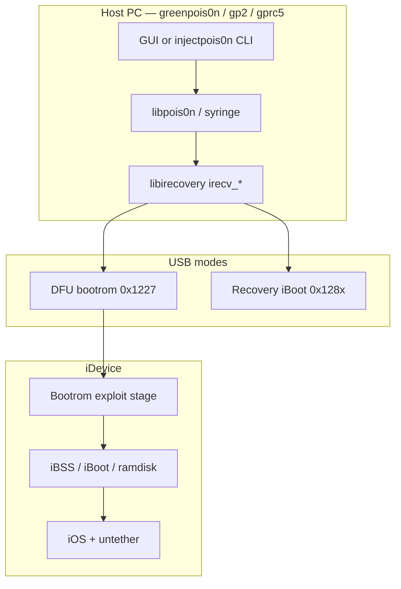
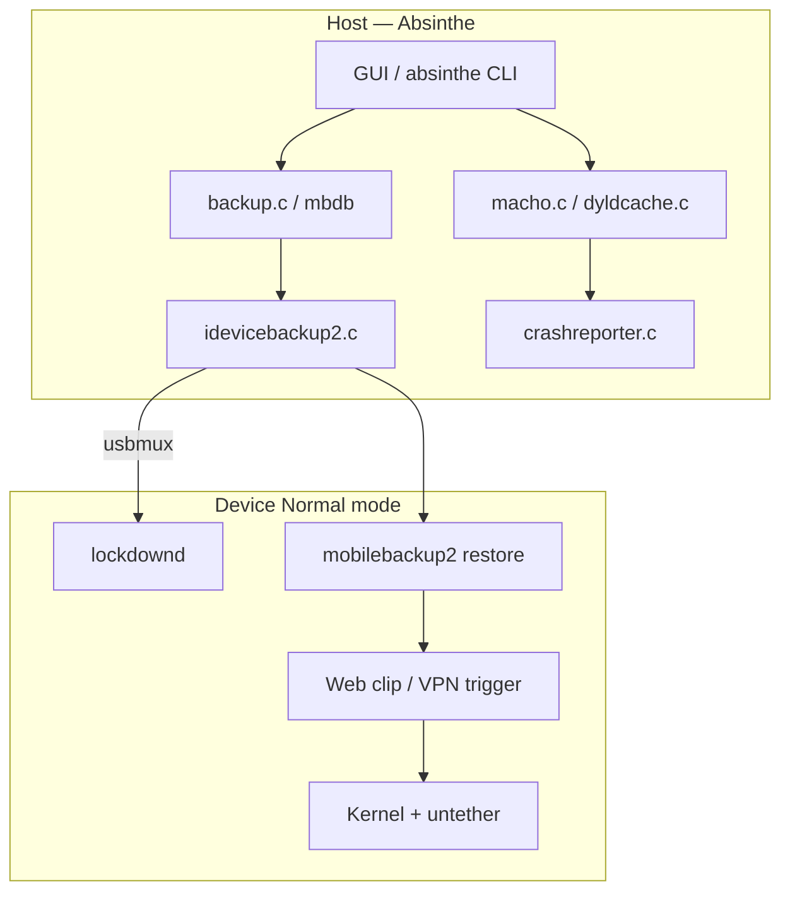
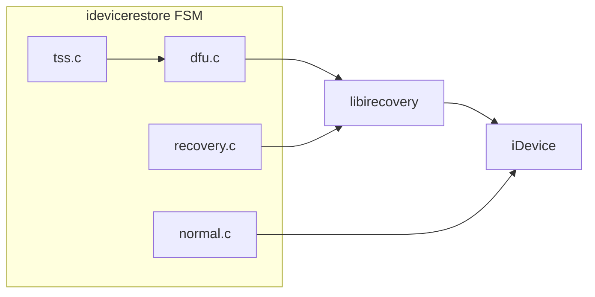

# Legacy archive learnings

Educational synthesis from local mirrors under [`legacy/`](../../legacy/). These trees are **read-only references** (gitignored at repo root); they are not vendored into `src/`.

**Snapshot:** 2026-06-01 — Chronic-Dev (36), OpenJailbreak (46), posixninja (29). **111 repos total.**

**Policy:** Study host I/O, parsers, CLI patterns, and architecture. Do **not** copy exploit blobs, ramdisk payloads, or weaponized backup staging into purplepois0n.

**Related:** [INTEGRATION_PLAN.md](INTEGRATION_PLAN.md) · [REPO_INDEX.md](REPO_INDEX.md) · [COMPARISON_MATRIX.md](COMPARISON_MATRIX.md) · [PHASE_STATUS.md](PHASE_STATUS.md) · [SUPPORT.md](../SUPPORT.md)

---

## Archive layout and caveats

| Mirror | Path | Notes |
|--------|------|-------|
| Chronic-Dev | `legacy/Chronic-Dev/` | Primary Gen-0 lineage (greenpois0n, absinthe, syringe) |
| OpenJailbreak | `legacy/OpenJailbreak/` | Later forks + libraries (`libmbdb`, `ipwndfu`, `Undecimus`) |
| posixninja | `legacy/posixninja/` | Author forks (`libchronic`, `libirecovery-2.0`, `libmacho`, `xpwn`) |

**Clone failure:** `OpenJailbreak/Chimera13` — GitHub HTTP 451 / repository blocked; not present in snapshot.

**Submodule shells:** `legacy/Chronic-Dev/greenpois0n/` cloned but **submodules are empty** (`anthrax`, `cyanide`, `syringe`, `libirecovery`, `doctors`, `medicine` are 0-byte dirs). Use the **standalone** `legacy/Chronic-Dev/syringe` and `legacy/Chronic-Dev/libirecovery` clones for source instead of `greenpois0n/` paths.

---

## Category 1: greenpois0n / gp2 / gprc5 (DFU-first jailbreak hosts)

### What it is

The Chronic Dev **greenpois0n** line (~2010–2011) was a desktop host utility for **A4-class** devices on iOS 4.x. It detected DFU/Recovery over USB, ran bootrom-era entry (limera1n/SHAtter lineage), staged iBSS/iBoot/ramdisk artifacts, and installed an **untethered** jailbreak. **gp2** and **gprc5** are later release-candidate trees with fuller build orchestration (payloads, exploits dylibs, GUI/Xcode projects).

### Architecture

| Component | Language | Build | Role |
|-----------|----------|-------|------|
| **syringe** | C, libusb | Makefile | Core USB library: forked libirecovery, exploit hooks, `libpois0n` inject API |
| **libirecovery** | C | autotools / Makefile | DFU/Recovery USB client (`irecv_*`) |
| **anthrax** | C/shell | Makefile | Custom ramdisk build |
| **cyanide** | mixed | Makefile | Payload packaging |
| **doctors** | C | Makefile | CLI utilities (`injectpois0n`) |
| **medicine** | mixed | Makefile | Bundled assets / installers |
| **gp2** | C + dylibs | top-level Makefile | Orchestrates libs → payloads → exploits → anthrax → syringe → doctors |
| **gprc5** | C + ObjC/Xcode | Makefile + `.xcodeproj` | RC5-era GUI; embeds full syringe subtree |
| **greenpois0n** | Eclipse `.project` | Makefile + git submodules | Meta-repo; **submodules not initialized** in this snapshot |

Host stack: **libusb** → **irecv** control/bulk transfers → bootrom/iBoot command channel → (historical) exploit + IMG upload → kernel/userland persistence.

### Data flows

**Normal mode** was secondary for greenpois0n (pairing for status only). **Backup** was not the primary delivery path (contrast Absinthe).

### purplepois0n vs gaps

| Area | purplepois0n today | Gap |
|------|-------------------|-----|
| DFU detect/open | `DeviceManager`, `DFUDevice` via modern libirecovery | No `irecv_event` progress callbacks |
| Recovery + ECID | `RecoveryDevice` (ECID ctor) | `enumerateDevices()` often omits ECID; `--gen0` may use ECID `0` |
| Bootrom exploit | `Checkm8` wrapper → gaster/ipwndfu | No limera1n/SHAtter; checkm8 external only |
| IMG3/iBSS staging | — | Not implemented |
| Ramdisk / untether | — | Not implemented (intentional) |
| GUI one-click | CLI only | No Qt/GTK shell |

### Safe to port vs do not port

| Safe to study/port (patterns) | Do not port |
|------------------------------|-------------|
| `irecv_open_with_ecid` retry loops (see `idevicerestore/src/dfu.c`) | `syringe/exploits/limera1n/`, `pwnage2/`, `steaks4uce/` |
| CPID/BDID tables in `syringe/include/libirecovery.h` | `include/payloads/iBoot.*.h`, `iBSS.*.h` binary blobs |
| `libpois0n.h` callback/progress API shape (reimplement cleanly) | `pois0n_inject()` exploit orchestration |
| Mode detection (`kDfuMode` vs `kRecoveryMode*`) | Ramdisk `.dmg`, kernelcache bundles |
| CLI flag layout from `doctors/cli/injectpois0n` | Weaponized restore steps |

### Key files to study

| Path | Why |
|------|-----|
| `legacy/Chronic-Dev/syringe/include/libirecovery.h` | Original Chronic-Dev irecv API, CPID constants |
| `legacy/Chronic-Dev/syringe/syringe/libirecovery.c` | USB connect, Windows GUID paths, control transfers |
| `legacy/Chronic-Dev/syringe/include/libpois0n.h` | High-level inject API surface |
| `legacy/Chronic-Dev/syringe/syringe/common.c` | Shared helpers |
| `legacy/Chronic-Dev/gp2/Makefile` | Build graph (libs → payloads → exploits → syringe) |
| `legacy/Chronic-Dev/gprc5/README` | RC-era bug notes (USB stability, AppleTV DFU) |
| `legacy/Chronic-Dev/libirecovery/src/libirecovery.c` | Canonical fork before libimobiledevice maintenance |
| `legacy/posixninja/libirecovery-2.0/` | Author's later irecv fork |

---

## Category 2: syringe (USB exploit delivery library)

### What it is

**Syringe** is Chronic-Dev's low-level host library bundled with greenpois0n. It vendors libusb, zlib, curl, and a **fork of libirecovery**, plus exploit modules and embedded iBoot/iBSS payloads. It is the **reference implementation** for how 2010-era tools talked to Apple DFU/Recovery endpoints.

### Architecture

- **Languages:** C (primary), platform-specific Win32 shims
- **Build:** per-directory Makefiles; `utilities/` CLIs (`injectpois0n`, `loadibec`, `tetheredboot`)
- **Layers:** `libirecovery.c` (transport) → `libpois0n.c` (orchestration) → `exploits/*.c` (bootrom) → payload headers

### Data flows

Same as greenpois0n DFU path above. Syringe is the **narrow waist** between GUI/CLI and USB.

### purplepois0n vs gaps

purplepois0n uses **upstream libirecovery** (libimobiledevice) via C++ wrappers, not Syringe's vendored copy. Missing: progress events, `irecv_reset`, file upload helpers (`irecv_send_file`), and exploit registration table in `include/exploits.h`.

### Safe to port vs do not port

| Safe | Do not |
|------|--------|
| Error code enum parity checks | Entire `exploits/` tree |
| USB interface selection patterns | `include/resources/ramdisk.h` |
| Utility CLI argument parsing style | `injectpois0n.c` exploit invocation |

### Key files

- `legacy/Chronic-Dev/syringe/syringe/libpois0n.c`
- `legacy/Chronic-Dev/syringe/utilities/injectpois0n.c`
- `legacy/Chronic-Dev/syringe/include/exploits.h` (API shape only)
- `legacy/posixninja/syringe/` — parallel fork for diffing

---

## Category 3: absinthe / absinthe-2.0 (backup-mediated jailbreak)

### What it is

**Absinthe** (2012) jailbroke **A5** devices (iPhone 4S, iPad 2) on iOS 5.x via **normal-mode USB**: build or modify an iTunes backup, restore it through mobilebackup2, then trigger on-device activation (web clip / VPN). **Absinthe 2.0** extended to iOS 5.1.1 with richer Mach-O/dyldcache tooling, GUI (Qt-ish cross-platform), and per-device offset configs.

### Architecture

| Layer | Files | Tech |
|-------|-------|------|
| CLI core | `src/absinthe.c`, `src/jailbreak.c` | C, libimobiledevice, getopt |
| Backup | `src/backup.c`, `src/mbdb.c`, `src/mb2.c` | mbdb binary + mobilebackup2 protocol |
| Mach-O | `src/macho.c`, `src/macho_*.c` | Load commands, symtab, segments |
| Dyld cache | `src/dyldcache.c`, `src/dyldmap.c` | ASLR slide research from crash logs |
| ROP / patch | `src/rop.c`, `src/bpatch.c`, `tools/*` | Offset-driven patch generation |
| GUI | `gui/AbsintheJailbreaker.cpp`, platform `MainWnd_*` | iTunes killer, worker threads |
| Config | `src/config/iOS/*/constants.h`, `opt/*/offsets.h` | Per build/device offsets |

Build: autotools + bundled OpenSSL/libimobiledevice headers under `include/`.

### Data flows

**DFU/Recovery:** not primary entry for Absinthe A5 path.

### purplepois0n vs gaps

| Area | purplepois0n | Gap |
|------|-------------|-----|
| Lockdown / apps | `MobileDevice` | Parity OK for research |
| Offline backup parse | `MobileBackup` — plist, **Manifest.mbdb**, **Manifest.db** | Encrypted decrypt **deferred** (detect only) |
| Backup restore | — | Intentionally absent |
| Mach-O | `MachOBinary` → **ipswd** / **ipsw** / `MachOParser` | ROP/slide helpers not in-tree |
| Dyld cache | `DyldSharedCache` → **ipswd** / **ipsw** / `DyldCacheParser` | No crash→slide correlation (`find_aslr_slide`) |
| mobilebackup2 client | — | No live restore service wrapper |
| GUI | CLI | No cross-platform GUI |

### Safe to port vs do not port

| Safe | Do not |
|------|--------|
| `mbdb.c` / `mbdb_record.c` parse logic (educational reimplementation) | `jailbreak.c` exploit orchestration |
| `backup.c` domain/path index patterns | Weaponized backup **generation** (`fsgen`, `mb2insert` staging) |
| Mach-O segment/section structs | `rop.c` / `bpatch.c` exploit chains |
| `dyldcache.c` header/mapping parse ideas | Per-device `offsets.h` weaponization |
| `idevicepair.c` pairing flow | `iTunesKiller` as required behavior |

### Key files

- `legacy/Chronic-Dev/absinthe-2.0/src/mbdb.c`, `mbdb_record.c`
- `legacy/Chronic-Dev/absinthe-2.0/src/backup.c`, `backup_file.c`
- `legacy/Chronic-Dev/absinthe-2.0/src/macho.c`, `macho_command.c`
- `legacy/Chronic-Dev/absinthe-2.0/src/dyldcache.c`
- `legacy/Chronic-Dev/absinthe-2.0/src/idevicebackup2.c`
- `legacy/Chronic-Dev/absinthe/src/absinthe.c` (earlier A5 CLI)
- `legacy/OpenJailbreak/libmbdb/` — standalone mbdb library

---

## Category 4: apparition (backup protocol research)

### What it is

**Apparition** is a Chronic-Dev research tool for **mobilebackup2** and **mbdb** manipulation—crash-driven probing of the backup restore service, AFC, and lockdown. It shares file layout with absinthe-2.0 (`mbdb`, `mb2`, `backup`, `crashreport*`) but focuses on protocol research rather than shipping a GUI jailbreak.

### Architecture

- **Language:** C
- **Build:** autotools (`configure.ac`, `Makefile.am`)
- **Modules:** `apparition.c` (orchestration), `mb2.c` (mobilebackup2), `mbdx.c` (extended mbdb), `afc.c`, `lockdown.c`, `device.c`

### Data flows

Normal-mode only: lockdown → mobilebackup2 → (research) crash → crash report copy → offline analysis.

### purplepois0n vs gaps

`MobileBackup` covers **offline plist manifests**; apparition covers **live mb2** and **mbdb** eras. No `mb2_t` client in purplepois0n.

### Safe to port vs do not port

| Safe | Do not |
|------|--------|
| `mbdb.c` record iteration | `mb2_crash()` and exploit hooks in `apparition.c` |
| `backup_get_file_index()` lookup pattern | Live restore weaponization |
| `afc.c` connection lifecycle | — |

### Key files

- `legacy/Chronic-Dev/apparition/src/mbdb.c`, `backup.c`
- `legacy/Chronic-Dev/apparition/src/mb2.c`, `mb2.h`
- `legacy/Chronic-Dev/apparition/src/apparition.c` (orchestration API shape only)

---

## Category 5: libirecovery / idevicerestore (host I/O foundations)

### What it is

**libirecovery** communicates with iBoot/iBSS/DFU over USB (`irecv_open`, memory R/W, commands, file upload). Chronic-Dev's fork evolved into the [libimobiledevice/libirecovery](https://github.com/libimobiledevice/libirecovery) project. **idevicerestore** reimplements Apple's restore FSM: DFU → iBSS → iBoot → ASR → normal, using irecv + libimobiledevice + TSS.

### Architecture

| Repo | Language | Build |
|------|----------|-------|
| libirecovery | C | autotools |
| idevicerestore | C | autotools |
| irecovery (Chronic-Dev) | C CLI | ships with libirecovery |

### Data flows

purplepois0n uses libirecovery **directly** (not idevicerestore's state machine). Link against **libirecovery-1.0** with `<libirecovery.h>`; client handle is `irecv_client_t`. Shared open/retry/ECID/memory helpers: `src/IRecvUtil.*`.

### purplepois0n vs gaps

| Implemented | Missing |
|-------------|---------|
| `DFUDevice` / `RecoveryDevice` on `irecv_client_t` (libirecovery 1.x) | — (progress via `IRecvProgressSubscription`) |
| ECID + CPID in DFU/Recovery enumeration (`IRecvUtil`, `-l`) | IMG3 parse, TSS, restore FSM |
| Retry on `irecv_open_with_ecid` (10× / 1s) | Full idevicerestore orchestration |
| USB memory R/W with 32-bit address split | In-tree limera1n/checkm8 USB sequences |
| checkm8 external invoke (`Checkm8`, `-m`) | Pongo / KPF / ramdisk load |

### Safe to port vs do not port

| Safe | Do not |
|------|--------|
| `dfu_client_new()` retry loop | `limera1n.c` in idevicerestore |
| `irecv_progress_callback` pattern | Full restore orchestration without explicit scope |
| `tools/irecovery.c` CLI UX | SHSH/blob signing paths |

### Key files

- `legacy/Chronic-Dev/libirecovery/src/libirecovery.c`
- `legacy/Chronic-Dev/libirecovery/tools/irecovery.c`
- `legacy/Chronic-Dev/idevicerestore/src/dfu.c`, `recovery.c`, `dfu.h`
- `legacy/posixninja/libirecovery-2.0/src/libirecovery.c`

---

## Category 6: libchronic / libmacho (shared utilities)

### What it is

**libchronic** (Chronic-Dev and posixninja forks) is a tiny **C utility library**: file I/O, debug logging, endianness, architecture helpers, boolean types. Absinthe and apparition depend on it via `#include <chronic/...>`. **libmacho** (posixninja) is a larger standalone Mach-O parser predating absinthe's in-tree `macho.c`.

### Architecture

- libchronic: ~9 source files, no autotools complexity
- libmacho: full parser with tests (posixninja)

### purplepois0n vs gaps

purplepois0n's C++ parsers (`MachOParser`, `DyldCacheParser`) replace libmacho/libchronic roles. Optional: adopt `chronic/file.h` patterns for cross-platform path helpers in C++.

### Safe to port vs do not port

| Safe | Do not |
|------|--------|
| `architecture.c` CPU type names | — |
| `file.c` read/write helpers (reimplement in C++) | — |
| libmacho load-command coverage audit | Copy GPL tree wholesale |

### Key files

- `legacy/posixninja/libchronic/include/chronic/chronic.h`
- `legacy/posixninja/libchronic/src/file.c`
- `legacy/posixninja/libmacho/` (compare coverage to `src/MachOParser.cpp`)
- `legacy/Chronic-Dev/libchronic/` (org copy)

---

## Category 7: OpenJailbreak mirrors (later generations)

### What it is

OpenJailbreak aggregates **post-2012** tools and libraries: evasi0n6, yalu, Undecimus, ipwndfu, libmbdb, libdyldcache, spirit, etc. Useful for **cross-generation** parser and USB patterns—not Gen-0 primary sources.

### High-value overlaps with purplepois0n roadmap

| Repo | Maps to |
|------|---------|
| `libmbdb` | `MobileBackup` mbdb gap |
| `libdyldcache` / `libmacho` | `DyldCacheParser` / `MachOParser` validation |
| `ipwndfu` | `Checkm8` external reference (see below) |
| `libirecovery`, `libimobiledevice` | Same stack purplepois0n links today |
| `greenpois0n`, `absinthe-2.0` | Duplicates of Chronic-Dev; use for diff only |

**Missing:** `Chimera13` (451 blocked).

### ipwndfu (checkm8 — study only)

- **Upstream:** [axi0mX/ipwndfu](https://github.com/axi0mX/ipwndfu)
- **Local mirror:** `legacy/OpenJailbreak/ipwndfu` (when cloned per [ARCHIVES.md](../ARCHIVES.md))
- **In-tree use:** `src/Checkm8.cpp` — CPID tables + delegation to **gaster** (`PURPLEPOIS0N_GASTER` / PATH) or **ipwndfu** (`PURPLEPOIS0N_IPWNDFU` → `python3 ipwndfu -p`). No USB exploit reimplementation in purplepois0n.
- **USB contention:** `Checkm8::runCheckm8` opens DFU for probe, then **releases** the handle (`DFU handle released; starting checkm8`) before invoking the external tool.

See [REPO_INDEX.md](REPO_INDEX.md) for the full table.

---

## Category 8: posixninja forks (author lineage)

### What it is

Personal forks that often **predate or parallel** Chronic-Dev releases: `syringe`, `libirecovery-2.0`, `libchronic`, `libmacho`, `xpwn` (IPSW/img3 tooling), `spirit-linux`.

### purplepois0n relevance

- Confirms API choices in modern purplepois0n (`RecoveryDevice` ECID requirement, DFU-first detection) match author intent in 2010–2012 code.
- `xpwn/` is valuable for **IMG3/IPSW format education** (not exploit delivery)—compare to missing IMG3 support in purplepois0n.

### Key files

- `legacy/posixninja/libirecovery-2.0/include/libirecovery/libirecovery.h`
- `legacy/posixninja/xpwn/ipsw-patch/img3.c`, `imagetool.c`
- `legacy/posixninja/spirit-linux/` — earlier normal-mode tool patterns

---

## Cross-cutting lessons for purplepois0n

1. **Mode ordering:** Chronic-Dev tools probe **DFU before Recovery before Normal** — matches `DeviceManager::detectDeviceState`.
2. **ECID is structural:** Recovery opens require ECID; absinthe uses UDID. purplepois0n must unify both in enumeration.
3. **Two host eras:** DFU bootrom tools (greenpois0n) vs backup-mediated normal tools (absinthe)—different classes, same repo today.
4. **Manifest format drift:** iOS 5 backups used **Manifest.mbdb**; later uses **Manifest.plist**. `MobileBackup` handles plist; mbdb is the main parser gap.
5. **Progress UX:** idevicerestore's `IRECV_PROGRESS` events explain why legacy tools felt responsive during long USB uploads.
6. **Build graphs matter:** gp2 Makefile documents component order—useful when adding optional Gen-0 plugin modules.
7. **Do not submodule empty shells:** Always clone standalone repos listed in `legacy/README.md` Gen-0 set.
8. **checkm8 is a different generation:** ipwndfu/gaster belong to Gen 5; wire via `Checkm8`, not limera1n paths.
9. **Open libraries won:** Modern purplepois0n correctly links libimobiledevice/libirecovery rather than vendoring syringe's curl/zlib trees.
10. **Educational boundary is explicit:** absinthe's `jailbreak.c` and syringe's `exploits/` are study-only; port parsers and transport, not staging.

---

## Validation notes

| Claim | Verified how |
|-------|----------------|
| Repo counts (36/46/29) | `legacy/README.md`, directory listing 2026-06-01 |
| greenpois0n empty submodules | `ls legacy/Chronic-Dev/greenpois0n/*` — 64-byte dirs |
| MobileBackup plist-only | `src/MobileBackup.cpp` `parseManifest()` — no mbdb branch |
| Checkm8 external wrapper | `src/Checkm8.cpp` |
| Chimera13 failure | `legacy/README.md` Known failures |

**Unverified in this pass:** Building legacy trees on macOS 2026; runtime behavior against real devices.
