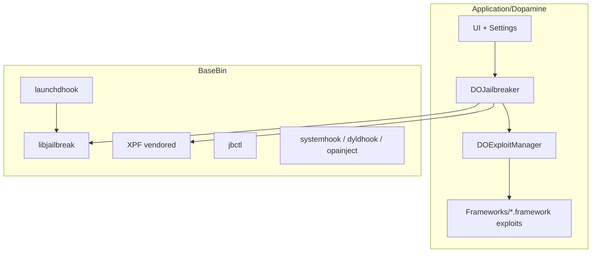
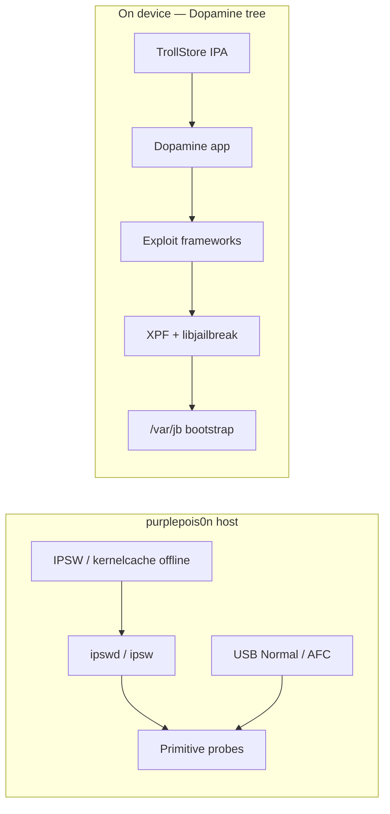

# Modern era (Gen 6) — local mirror learnings

**Snapshot:** 2026-06-03  
**Mirrors:** `legacy/modern-era/` (16 repos, gitignored — refresh via [`legacy/clone-modern-era.sh`](../../legacy/clone-modern-era.sh))  
**Bibliography:** [book/deep/modern-era-web-sources.md](../book/deep/modern-era-web-sources.md) · [puaf-kfd-era.md](../book/deep/puaf-kfd-era.md)

Educational synthesis from cloned upstream trees. **Do not port exploit trigger code into purplepois0n `src/`.**

---

## What this mirror set is for

Generation 6 jailbreaks (Dopamine 2.x, rootless `/var/jb`) run **on device**. purplepois0n stays **host-side**: USB, backup parse, IPSW/dyld analysis (ipswd), and honest primitive probes. These clones let contributors read real integration code without guessing from wiki summaries.

| purplepois0n need | Study in mirrors |
|-------------------|------------------|
| Offline kernelcache / dyld research | XPF layout, `libgrabkernel2`, Dopamine `gatherSystemInformation` |
| Know what host must *not* do | Full `DOJailbreaker.m` chain, exploit frameworks |
| Phase 6.7 delegate hook | TrollStore URL scheme, Dopamine install path |
| Primitive gap messages | `DOExploit` types vs our `KernelCapabilityProbePrimitive` |

---

## Mirror inventory

| Path | Upstream | Priority | Role |
|------|----------|----------|------|
| `Dopamine/` | opa334/Dopamine `2.x` | **P0** | Integration hub — app + BaseBin + exploit frameworks |
| `kfd-opa334/` | opa334/kfd | **P0** | Dopamine-fork libkfd |
| `kfd-felix-pb/` | felix-pb/kfd | **P0** | Original PUAF write-ups + reference libkfd |
| `XPF/` | opa334/XPF | **P0** | Kernel patchfinder (Choma-based) |
| `weightBufs/` | 0x36/weightBufs | **P0** | ANE kernel exploit (standalone) |
| `multicast_bytecopy/` | potmdehex/multicast_bytecopy | **P0** | Multicast CoW kernel exploit |
| `darksword-kexploit/` | opa334/darksword-kexploit | **P0** | Kernel port (separate from full WebKit chain) |
| `TrollStore/` | opa334/TrollStore | **P1** | Permasigned IPA install (CoreTrust) |
| `libroot/` | opa334/libroot | **P1** | Rootless path API (`/var/jb`) |
| `libkrw/` | Siguza/libkrw | **P1** | Kernel R/W API + plugin model |
| `libgrabkernel2/` | alfiecg24/libgrabkernel2 | **P1** | On-device kernelcache download |
| `Procursus/` | ProcursusTeam/Procursus | **P1** | Rootless bootstrap packages |
| `ellekit/` | tealbathingsuit/ellekit | **P1** | Tweak injection (Substrate/libhooker API) |
| `Fugu15/` | opa334/Fugu15 | **P2** | Dopamine 1.x lineage |
| `multicast_bytecopy_A9/` | wh1te4ever/… | **P2** | A9 multicast fork |
| `DarkSword-Analysis/` | AntonioCiolino/… | **P2** | ITW chain reconstruction docs |

**Note:** Shallow `Dopamine` @ `2.x` HEAD (2026-06-03) bundles `Exploits/{kfd,dmaFail,weightBufs,multicast_bytecopy,badRecovery}` — **DarkSword** lands via separate `darksword-kexploit` framework in newer 2.5 builds; not always present on every `2.x` commit.

---

## Dopamine architecture (from tree)

### Top-level split



| Area | Path | Purpose |
|------|------|---------|
| **Jailbreak orchestration** | `Application/Dopamine/Jailbreak/DOJailbreaker.m` | XPF patchfind → exploit run → phys R/W → trust cache → launchd inject |
| **Exploit picker** | `DOExploitManager.m` | Loads `Frameworks/*.framework` with `DPExploitType` + `DPExploitFlavors` in Info.plist |
| **Exploit modules** | `Application/Dopamine/Exploits/` | Source for bundled frameworks (kfd, dmaFail, …) |
| **Runtime jailbreak lib** | `BaseBin/libjailbreak/` | Primitives, trust cache, kcall, physrw, codesign — shared with hooks |
| **Persistence / hooks** | `BaseBin/launchdhook`, `systemhook`, `dyldhook` | Rootless injection path (replaces jailbreakd model) |
| **CLI tools** | `BaseBin/jbctl`, `boomerang`, `forkfix` | Trust cache, userspace reboot helpers |
| **Packages** | `Packages/libkrw-provider`, `libroot` | Bootstrap debs |

### Exploit type taxonomy (Dopamine)

From `DOExploit.h`:

| `ExploitType` | Role | In-tree modules (2.x sample) |
|---------------|------|------------------------------|
| `EXPLOIT_TYPE_KERNEL` | Kernel R/W | kfd, weightBufs, multicast_bytecopy, DarkSword (2.5+) |
| `EXPLOIT_TYPE_PAC` | PAC / CFI bypass | badRecovery |
| `EXPLOIT_TYPE_PPL` | PPL bypass | dmaFail |

Picker selects highest-**priority** supported exploit per type (`DOExploitManager._findPreferredExploitForType`).

### Jailbreak chain shape (conceptual — read `DOJailbreaker.m`)

1. **Kernelcache** — `DOEnvironmentManager` + `libgrabkernel2` / network (`accessibleKernelPath`).
2. **XPF** — `xpf_start_with_kernel_path` → offset sets (`translation`, `trustcache`, `sandbox`, `physmap`, `struct`, `physrw`, …).
3. **Exploit run** — `DOExploit` `load` / `run` for KERNEL, then PAC, then PPL as needed.
4. **libjailbreak** — build phys R/W, patch kernel, trust cache, unsandbox, platformize.
5. **Bootstrap** — inject launchd hook, install BaseBin to `/var/jb`, Procursus bootstrap, ElleKit path.

purplepois0n **must stop at step 0 on host** (offline IPSW kernelcache) — steps 3–5 are on-device only.

### kfd integration in Dopamine

- Wrapper: `Exploits/kfd/kfd.m` — exports `kread*` / `kwrite*` to libjailbreak via `gKfd = kopen(...)`.
- Vendored libkfd under `Exploits/kfd/Exploit/libkfd/` (PUAF + KRKW headers per method).
- Slide from `((struct kfd *)gKfd)->info.kaddr.kernel_slide` after `kopen`.

Compare with standalone `kfd-opa334/` and `kfd-felix-pb/` for upstream drift.

### dmaFail (PPL)

- `Exploits/dmaFail/dmaFail.c` (~437 lines) — gates on `hw.cpufamily` (A12–A16 class).
- Pairs with kernel R/W from kfd or siblings; not a standalone kernel exploit.

---

## Upstream repos (standalone)

### kfd (felix-pb vs opa334)

| Item | Location |
|------|----------|
| Public API | `kfd/libkfd.h` — `kopen`, `kread`, `kwrite`, `kclose` |
| PUAF methods | `puaf_physpuppet`, `puaf_smith`, `puaf_landa` (+ enums in fork) |
| KRKW | `writeups/exploiting-puafs.md` |
| Version tables | `kfd/libkfd/info/` — `static_types/`, `dynamic_types/`, `info_init()` |

**Study order:** felix-pb README → writeups → opa334 fork diff → Dopamine `kfd.m` glue.

### XPF

- Entry: `src/xpf.h` — `xpf_start_with_kernel_path`, `xpf_construct_offset_dictionary`.
- Built on **Choma** (Mach-O patch finder) — same family as trust cache / code signature tooling in BaseBin.
- Dopamine calls XPF **before** exploits to build `systemInfo` xpc dictionary used by libjailbreak.

**purplepois0n mapping:** offline `--analyze-binary` on kernelcache + ipswd JSON complements but **does not replace** runtime XPF on device.

### weightBufs / multicast_bytecopy

- Standalone PoCs vendored into Dopamine as frameworks with `DPExploitFlavors`.
- weightBufs targets **Apple Neural Engine** (CVE cluster in ANE driver).
- multicast_bytecopy: Project Zero #2224 lineage; A9 fork in `multicast_bytecopy_A9/`.

### darksword-kexploit

- Objective-C port of kernel stage only; **not** the WebKit watering-hole chain.
- README documents ICMPv6 / VFS race technique class (ITW CVE-2025-43520).
- Offsets often hardcoded per iOS band — integration pain called out in Dopamine 2.5b release notes.

### TrollStore + install path

- CoreTrust bug → permasigned “System” apps on supported iOS bands.
- URL scheme hijack: `apple-magnifier://install?url=…` for IPA install from browser/helper.
- **Persistence helper** required after icon-cache reload on many versions.
- Dopamine distribution often: TrollStore → install Dopamine IPA → run on device.

**Phase 6.7 hook idea:** host opens IPA URL or documents TrollStore install — never embeds exploit.

### libkrw + libroot

- **libkrw:** standard kernel R/W API; Dopamine ships **plugin** (`Packages/libkrw-provider`) instead of tfp0-only path.
- **libroot:** `jbroot` / `rootfs` prefix helpers for rootless packages — purplepois0n does not need to implement; useful for understanding AFC paths post-JB.

### ellekit

- Tweak hooking library (Substrate/libhooker compatible); used by Dopamine, palera1n, meowbrek2.
- Upstream: `tealbathingsuit/ellekit` (docs previously cited `evelynekitty/ElleKit` — **wrong URL**).

### Procursus

- Rootless package bootstrap (apt, Sileo/Zebra feeds). Large tree — study package layout and `/var/jb` prefix, not full build unless packaging.

---

## Data flows: host vs device



| Flow | purplepois0n | Dopamine mirrors |
|------|--------------|------------------|
| Get kernelcache | Offline IPSW extract; optional ipswd | `libgrabkernel2`, network in app |
| Find offsets | `--analyze-binary` / JSON export | XPF on device |
| Kernel R/W | **Not in repo** | kfd / weightBufs / … |
| Install JB | **Not in repo** | TrollStore + Dopamine |
| Pull logs / IPA | `AFCService` (future CLI) | — |

---

## purplepois0n vs mirrors

| Capability | In purplepois0n | Study mirror | Port? |
|------------|-----------------|--------------|-------|
| libkfd / PUAF | — | kfd-*, Dopamine/Exploits/kfd | **No** |
| XPF runtime | — | XPF, Dopamine DOJailbreaker | **No** |
| Kernelcache offline | ipswd, MachOBinary | XPF input format | **Already host** |
| Exploit picker UI | — | DOExploitManager | **No** |
| Rootless bootstrap | — | Procursus, BaseBin | **No** |
| TrollStore install | — | TrollStore | **Delegate only (6.7)** |
| Version / device probe | NormalModeProbePrimitive | DOEnvironmentManager | **Partial** |
| Honest gap logs | KernelCapabilityProbePrimitive | Full chain | **Yes (docs/probes)** |

### Safe to study

- `DOExploitManager` framework loading pattern (metadata-driven modules).
- XPF **interface** shape (what patchfinding consumes — not gadget chains).
- `libroot` path conversion API for AFC/documentation.
- TrollStore URL scheme and supported iOS bands for user docs.
- kfd **API surface** and PUAF vocabulary for book chapters.

### Do not port

- Any `Exploits/*/exploit*` trigger paths, `dmaFail.c` MMIO sequences, DarkSword race logic.
- BaseBin hook binaries, trust-cache mutation, codesign bypass bytes.
- Procursus/deb staging into purplepois0n.

---

## Recommended reading order (new contributor)

1. `legacy/modern-era/kfd-felix-pb/README.md` + `writeups/exploiting-puafs.md`
2. `legacy/modern-era/Dopamine/Application/Dopamine/Jailbreak/DOExploit.h` + `DOExploitManager.m`
3. `legacy/modern-era/Dopamine/Application/Dopamine/Jailbreak/DOJailbreaker.m` (first ~150 lines — XPF + exploit order)
4. `legacy/modern-era/XPF/src/xpf.h` + one patchfinder set under `src/`
5. `legacy/modern-era/TrollStore/README.md` (install bounds)
6. [puaf-kfd-era.md](../book/deep/puaf-kfd-era.md) + [modern-era-web-sources.md](../book/deep/modern-era-web-sources.md)
7. Optional ITW: `DarkSword-Analysis/`, `darksword-kexploit/README.md`

---

## Refresh

```bash
./legacy/clone-modern-era.sh          # idempotent clone
find legacy/modern-era -name .git -type d | while read g; do
  (cd "$(dirname "$g")" && git pull --ff-only --quiet) || true
done
```

After Dopamine releases, re-clone or pull `Dopamine` and check `Application/Dopamine/Exploits/` for new modules.

---

## See also

- [REPO_INDEX.md](REPO_INDEX.md) — modern-era table
- [DOWNLOAD_COVERAGE.md](DOWNLOAD_COVERAGE.md) — Gen 6 coverage
- [INTEGRATION_PLAN.md § Phase 6](INTEGRATION_PLAN.md#phase-6-modern-era-primitives--host-research-gen-6-lane)
- [LEARNINGS.md](LEARNINGS.md) — Gen 0–5 categories
